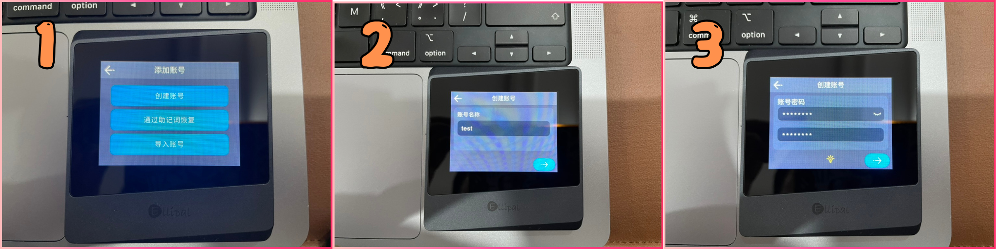
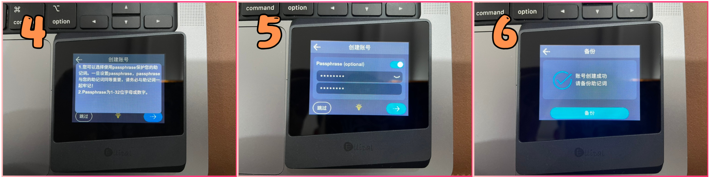
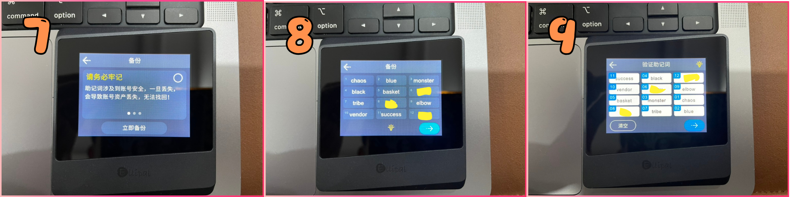
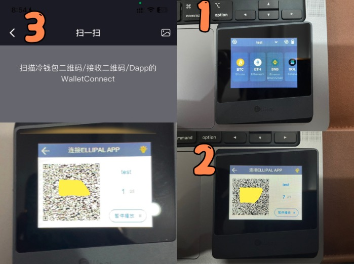
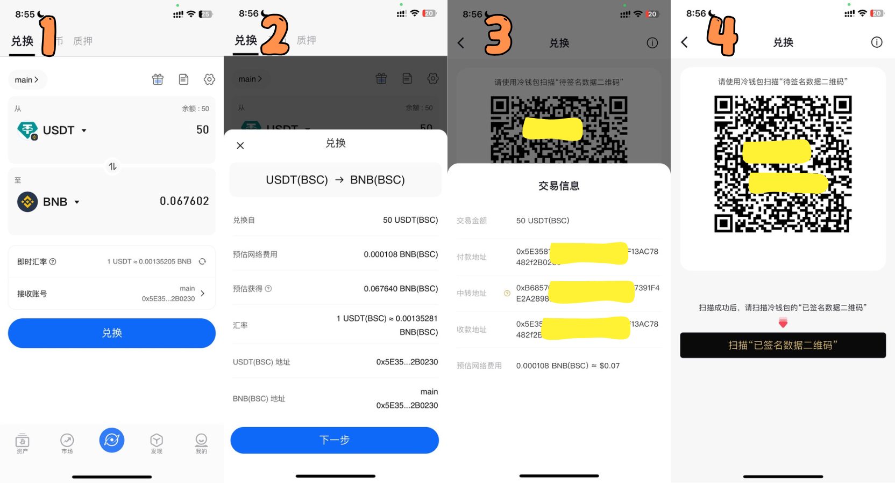
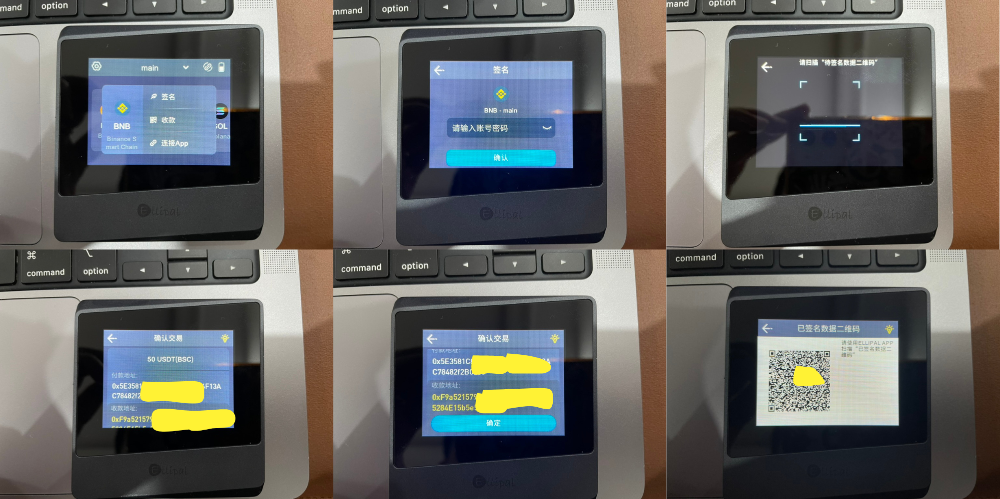

Hello，大家好，我是Momo。作为一名区块链技术学习者，我将把学习过程中的心得整理成文章与大家分享。本文是0x0系列的第一篇，主要介绍区块链基础相关知识，欢迎志同道合的朋友一起交流讨论。

推特：[@0xMomo](https://x.com/0xmomonifty) | 社区：[Telegram](https://t.co/JQ78TtwxeJ)

本系列所有代码和教程开源在github: https://github.com/0xMomo-NGClubs/Web3-Learning

# 0x00 冷钱包的本质

很多人可能认为OKX Wallet、MetaMask等浏览器插件或APP就是热钱包，而Ellipal之类的硬件设备就是冷钱包。但实际上，冷钱包的本质定义是：**私钥永不接触互联网的钱包**，也被称为离线钱包或断网钱包。

冷钱包的实现方式有多种：
1. 纸钱包：将私钥手写记录
2. 物理存储：将私钥存储在光盘或U盘中
3. 离线设备：使用永不联网的设备生成和存储私钥
4. 硬件钱包：专业的冷钱包硬件设备

相比传统热钱包直接在线生成和使用私钥的方式，冷钱包是一种用于离线存储私钥的方式，其主要特点是不与互联网连接，从而提供更高的安全性。虽然可以使用如TP钱包的冷钱包功能来实现基础的冷存储，但这种方式操作繁琐且不够便捷，这也是为什么专业的硬件钱包应运而生。

# 0x01 硬件钱包的核心特点

硬件钱包作为专业的冷钱包解决方案，具有以下关键特点：

1. **安全性**：采用独立安全芯片，确保私钥完全离线存储
2. **防护性**：内置密码保护和双重认证，防止物理篡改
3. **便携性**：体积小巧，界面友好，支持多币种
4. **易用性**：可对接主流钱包，支持DApp交互和安全签名

# 0x02 硬件钱包交易原理

硬件钱包不仅确保私钥安全，还能实现便捷的交易操作。其交易流程如下：

1. 用户通过钱包APP（观察钱包模式）进行DApp登录和操作
2. 交易发起时，通过蓝牙、USB或二维码将交易信息传输至硬件钱包
3. 硬件钱包在离线环境中完成交易签名
4. 签名后的交易信息通过钱包APP广播到区块链网络

这种设计确保了私钥始终存在于硬件钱包的安全环境中，同时又不影响正常的交易体验。

# 0x03 Ellipal硬件钱包介绍及使用体验

最近Momo一直在寻找一款既安全又实用的冷钱包，毕竟冷钱包可以不用但不能没有，而 ELLIPAL Mini 给了我不少惊喜。它采用了 100% 离线技术，确保在使用过程中完全不接触网络，从而有效避免了外部或黑客攻击的风险。所有操作和助记词管理都在设备内部完成，让对相关虚拟资产的安全性更加有保障。值得一提的是，它支持二维码交互和多账户管理，App 上可以容纳 20 个账户，还能直接与 DApp 交互，进行代币兑换，功能相当全面。

在价格方面，ELLIPAL Mini 的性价比非常高。与市面上一些价格较高的冷钱包相比，它的售价仅为 99 美元，却提供了与高端硬件钱包相媲美的大尺寸彩色触摸屏，操作起来更加直观便捷。而且，它的外观设计也很有特色，几何斜边框的造型既时尚又实用，携带起来也很方便，可以轻松融入我的Web3和日常生活。

总的来说，ELLIPAL Mini 在安全性、功能性和价格上都表现出色，是一款性价比极高且最‘冷’的硬件钱包，如果你也跟Momo一样在寻找一款硬件钱包，不妨考虑一下这款产品，体验感非常不错。

产品信息及购买链接：[https://www.ellipal.com/?rfsn=8511647.450f2e](https://www.ellipal.com/?rfsn=8511647.450f2e)
## Ellipal 使用体验及教程

### 硬件钱包

1. 这次Momo收到的圣诞礼盒包装的ELLIPAL Titan Mini 冷钱包，拆开包装盒内部有ELLIPAL Titan Mini设备主体、Type-C充电线、安全适配器、用户手册和2张助记词表格卡片，设备金属外观非常精美，本体小巧适合长期随身携带。

2. 长按设备顶部按钮即可开机，首次点亮在醒目的ELLIPAL开机LOGO后进入添加账号界面，我们可以选择[创建账号]，[通过助记词恢复]，[导入账号]，其中[导入账号]可以进行私钥方式等进行导入钱包，我们这里选择[创建账号]来进行钱包创建。

3. 我们依次按步骤填写好[账号名称]和[通过助记词恢复]后，来到了[Passphrase]界面，这里重点介绍一下 Passphrase， Passphrase通常与钱包的助记词结合使用，以生成唯一的私钥和地址。即使有人获取了你的助记词，如果没有正确的Passphrase，他们访问到的也只是默认助记词生成下的钱包，只有导入助记词+passphrase、才会真正显示原有钱包！

4. 填写完钱包信息后，开始备份助记词，既然都用冷钱包了我们就不要再拍照了，可以使用盒子里附赠的助记词表格卡片，也可以自己手抄再纸上，注意助记词与Passphrase不要写在一张纸上且分开存保存好（比如放入保险柜），不然就没多大意义了，写好后开始下一步验证助记词，按照助记词顺序依次点击屏幕助记词单词完成验证。到此，我们钱包就完成创建啦！

### Ellipal APP

ELLIPAL 加密钱包APP 是一款功能全面、安全可靠的数字资产管理系统，支持热钱包和冷钱包的灵活组合使用，兼容多种币种和 NFT，提供资产交换、购买、质押、DAPP 等丰富功能，致力于为用户提供便捷、安全的数字资产管理和增值体验.

1. 创建好钱包后，我们开始下载Ellipal 官方APP(支持谷歌商店、APP Store)，首次使用冷钱包的话我们点击APP右上角的扫描按钮，打开冷钱包右上角的连接按钮，用APP扫描冷钱包中自动播放的二维码（这里是每个钱包一个二维码），依次等待APP对所有二维码进行识别，完成后即可在APP中尽情使用。

2. 接下来我们来进行一次代币兑换（当然前提需要有资金转入过，这里就不在赘述啦），我们直接使用APP的兑换功能（当然也可以在APP的发现中使用Uniswap等dex），输入好兑换代币与金额后我们点击[兑换]按钮跳出兑换信息，点击[下一步]跳出交易信息，再次点[下一步]后就跳出了交易信息打包的二维码。

3. 我们拿起冷钱包，点击交易所在的链，点击[签名]，输入钱包创建的密码，然后点击[确认]后扫描APP弹出的二维码，冷钱包会弹出安全提示以及交易信息，务必再次仔细检查确认好交易是否正确，然后点击[确定]签名消息，签名完成后，冷钱包会弹出二维码。

4. 我们使用APP扫描冷钱包弹出的二维码，完成交易，整个过程中冷钱包没有与互联网连接，也没有使用数据线等方式，完全无网络完成交易！
5. 在一些链上项目中，也可以使用Ellipal APP 扫描 WalletConnect 二维码进行登录钱包，无须担心交互隔阂。

# 0x04 总结

在当今加密货币市场快速发展的背景下，安全性始终是用户最关心的问题。冷钱包作为一种物理隔离的硬件解决方案，为用户提供了最高级别的资产安全保障。

以‘最冷的冷钱包’ Ellipal Titan Mini 为例，它不仅在安全性方面表现出色，采用完全离线的 Air-gapped 技术，还在用户体验、性价比等方面都有很好的平衡。无论是对于加密货币新手还是资深用户，都是一个值得考虑的选择。

最后，我想强调的是，在使用冷钱包时，妥善保管助记词和 Passphrase 至关重要，建议将它们分开存储在安全的地方。同时，在进行任何交易操作时，都要仔细核对交易信息，确保资产安全。

