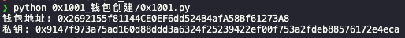
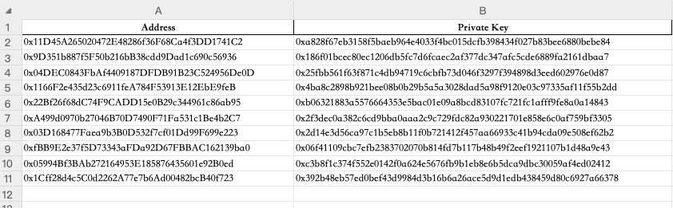

Hello，大家好，我是Momo。我最近在学习以太坊相关知识，将学习过程中的一些笔记整理成文章，分享给大家。本期0x1系列是小白基础知识，希望有志同道合的朋友一起学习讨论，也请大神们多多指教。

推特：[@0xMomo](https://x.com/0xmomonifty) | 社区：[Telegram](https://t.co/JQ78TtwxeJ)

本系列所有代码和教程开源在github:https://github.com/0xMomo-NGClubs/Web3-Learning

# 0x00 为什么需要生成这么多地址

在EVM链上，钱包地址可以用于交易、质押、投票等操作。
有些撸毛工作室需要批量生成大量地址，用于参与项目的交互来博取空投。
有些MEME项目需要批量生成地址，用于分散交易金额，避免被监控。
有些项目需要增加持币地址，来增加项目热度。
…

那么使用Python批量生成钱包地址，是一个不错的选择(因为Momo自己通常会用Python进行快速功能实现，Python语言简单易学，上手快,相关库也比较多)。

如果你还不熟悉Python编程语言，那么可以参考这个网站进行学习：[Python入门教程](https://www.runoob.com/python3/python3-tutorial.html)，其他语言的开发者也可以根据自己熟悉的语言进行开发，如JavaScript、Go、Rust等。


# 0x01 开发环境&工具
使用web3库，来与区块链网络进行交互，web3库是Python中用于与以太坊区块链网络进行交互的库，它可以帮助我们发送交易、查询余额、调用智能合约等操作。
```
pip install web3
```

Pandas库，是一个开源的Python库，主要用于数据分析和数据处理。在Pandas中，有一个数据结构叫做DataFrame，它是一个二维表格型数据结构，可以用于存储和处理数据，可以轻松地读写处理Excel、CSV等文件。在我们工作中也可以经常用它来处理表格，可以快速地进行数据处理，减少工作量。
```
pip install pandas
```

# 0x02 用Python生成私钥钱包地址

web3库中有一个方法，可以生成私钥钱包地址，我们可以使用这个方法来生成钱包地址。
导入web3库
```python
from web3 import Web3
```
创建一个钱包
```python
wallet = Web3.eth.account.create()
```
# 获取钱包地址和私钥
```python
address = account.address
private_key = account.key.hex()
```



# 0x03 批量生成钱包地址并导出表格

那我们接下来进行批量生成钱包地址，并导出表格，以备后续使用。
导入Pandas库
```python
import pandas as pd
```
根据num_wallets数量批量生成钱包地址
```python
num_wallets = 1000
wallets = []
for i in range(num_wallets):
    wallets.append(create_wallet())
```
将钱包地址和私钥转换为DataFrame
```python
df = pd.DataFrame(wallets, columns=['address', 'private_key'])
```
将DataFrame导出为Excel文件
```python
df.to_excel('wallets.xlsx', index=False)
```


# 0x04 总结

通过以上步骤，我们就可以批量生成钱包地址，并导出为Excel文件。