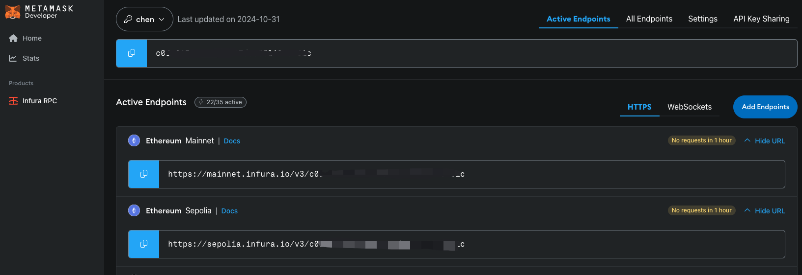

Hello，大家好，我是Momo。我最近在学习以太坊相关知识，将学习过程中的一些笔记整理成文章，分享给大家。本期0x1系列是小白基础知识，希望有志同道合的朋友一起学习讨论，也请大神们多多指教。

推特：[@0xMomo](https://x.com/0xmomonifty) | 社区：[Telegram](https://t.co/JQ78TtwxeJ)

本系列所有代码和教程开源在Github:https://github.com/0xMomo-NGClubs/Web3-Learning

# 0x00 简述

有时候我们钱包较多的时候，需要查询钱包余额，来判断钱包是否还有相关资产。

有时候我们需要来监控一些钱包来判断是否还有多少相关资产。

...
最简单的就是直接去区块链浏览器查询，如果钱包数量较多，那么查询起来就比较麻烦。

后面我们也会用dex相关API来计算钱包Token价值。

# 0x01 申请注册RPC服务商节点

在与链上交互的时候，我们需要有区块链网络节点，来与链上进行交互。最简单的就是使用RPC服务商节点，常用的如Infura、Alchemy、QuickNode等。

我这里常用的是[Infura](https://www.infura.io/)，注册一个账号，然后创建一个项目，就可以获取到 API Key 以及 URL。


当然还可以在 [Chainlist](https://chainlist.org/) 上找到很多免费的RPC节点。

# 0x02 读取链上数据

1 连接RPC节点(这里也可以连接其他EVM链，如BSC、Polygon、Arbitrum、Base、Optimism等)

```python
from web3 import Web3

w3 = Web3(Web3.HTTPProvider('https://mainnet.infura.io/v3/YOUR_PROJECT_ID'))
```

2 查询钱包ETH余额(使用web3库的get_balance方法来读取主网余额，单位：wei)

```python
balance = w3.eth.get_balance(wallet_address)
```

3 其他链上信息读取

读取区块高度

```python
block_number = w3.eth.block_number
```

读取区块信息

```python
block = w3.eth.get_block('latest')
```

读取GAS价格（单位：wei）

```python
gas_price = w3.eth.gas_price
```

# 0x03 从表格读取钱包地址，批量查询钱包ETH余额并保存

那么我们就可以用前期所学的知识，使用Pandas库从表格中读取钱包地址，批量查询钱包ETH余额并保存。

```python
# 表格表头：Address, Balance
def query_balance_from_excel(file_path):
    df = pd.read_excel(file_path)
    for index, row in df.iterrows():
        # 将地址转换为checksum格式, 防止地址大小写问题
        # checksum格式通常指的是EIP55校验地址。EIP55是一种以太坊地址校验标准，用于确保地址在大小写混合的情况下能够正确识别和验证。
        address = web3.Web3.to_checksum_address(row["Address"])
        balance = query_balance(address)
        df.at[index, "Balance"] = balance
    df.to_excel("address.xlsx", index=False)
```

# 0x04 读取ERC20代币余额

前面我们查询的是ETH余额，那么我们也可以查询ERC20代币余额。
这里我们调用了链上合约的ABI，来读取ERC20代币余额。什么是ABI，我们后面几期会详细讲解。

```python
def read_erc20_balance(address, token_address):
    # erc20合约abi
    # 后面会讲到abi是什么
    erc20_abi = [
        {
            "constant": True,
            "inputs": [{"name": "account", "type": "address"}],
            "name": "balanceOf",
            "outputs": [{"name": "", "type": "uint256"}],
            "payable": False,
            "stateMutability": "view",
            "type": "function",
        },
        {
            "constant": False,
            "inputs": [
                {"name": "to", "type": "address"},
                {"name": "value", "type": "uint256"},
            ],
            "name": "transfer",
            "outputs": [{"name": "", "type": "bool"}],
            "payable": False,
            "stateMutability": "nonpayable",
            "type": "function",
        },
    ]

    # 获取ERC20代币合约
    address = web3.Web3.to_checksum_address(address)
    token_address = web3.Web3.to_checksum_address(token_address)
    # 创建合约对象
    token_contract = w3.eth.contract(address=token_address, abi=erc20_abi)
    # 读取代币余额
    balance = token_contract.functions.balanceOf(address).call()
    print(f"钱包地址: {address} 的ERC20代币余额: {balance}")
    return balance
```

# 0x05 总结

以上是对区块链钱包余额查询的讲解，希望对大家有所帮助。