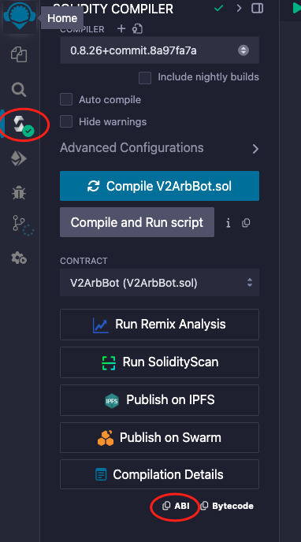
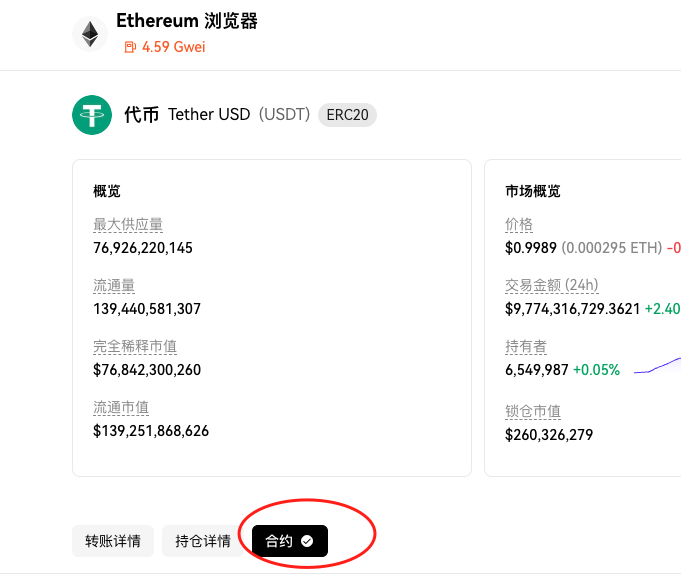
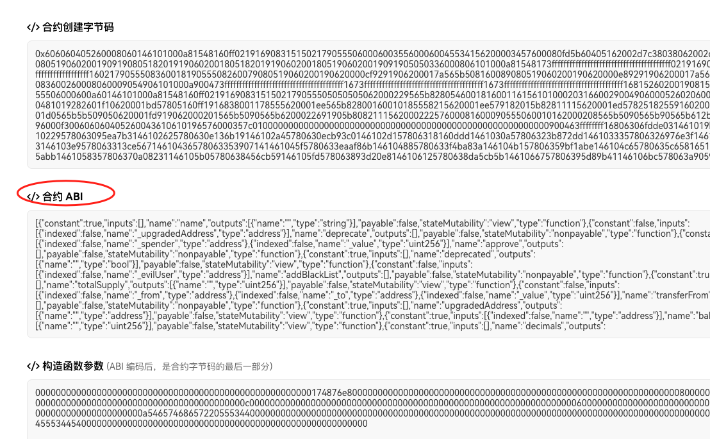

Hello，大家好，我是Momo。我最近在学习以太坊相关知识，将学习过程中的一些笔记整理成文章，分享给大家。本期0x1系列是小白基础知识，希望有志同道合的朋友一起学习讨论，也请大神们多多指教。

推特：[@0xMomo](https://x.com/0xmomonifty) | 社区：[Telegram](https://t.co/JQ78TtwxeJ)

本系列所有代码和教程开源在Github:https://github.com/0xMomo-NGClubs/Web3-Learning

# 0x00 简述

这一期主要介绍智能合约中的ABI（Application Binary Interface），主要涉及以下几个方面：

1. 什么是ABI
2. ABI的作用
3. ABI的格式
4. 如何使用Python调用ABI

我们大部分与区块链的交互都是通过ABI进行的，比如一些Dapp操作，代币转账，空投查询等。

# 0x01 什么是ABI

ABI（Application Binary Interface）是应用程序二进制接口的缩写，在以太坊中，ABI定义了如何与智能合约进行交互。它描述了合约的函数和事件的格式，使得外部程序（比如DApp前端）能够正确地调用合约的函数。

简单来说，ABI就像是智能合约的"说明书"，告诉我们：
- 合约有哪些函数可以调用
- 每个函数需要什么参数
- 函数会返回什么类型的数据

# 0x02 ABI的格式

ABI是一个JSON格式的文档，主要包含以下几个部分：

```json
[
    {
        "constant": true,
        "inputs": [
            {
                "name": "account",
                "type": "address"
            }
        ],
        "name": "balanceOf",
        "outputs": [
            {
                "name": "",
                "type": "uint256"
            }
        ],
        "payable": false,
        "stateMutability": "view",
        "type": "function"
    }
]
```

主要字段说明：
- constant：是否是只读函数
- inputs：函数输入参数
- name：函数名称
- outputs：函数返回值
- payable：是否可以接收ETH
- stateMutability：函数的状态可变性
- type：类型（function/event等）

# 0x03 如何获取ABI

获取ABI的主要方式有：

1. 合约编译时生成：如在Remix中编译合约时，会自动生成ABI（Remix是智能合约开发工具，后期学习Solidity时会详细介绍）


2. 区块链浏览器（如Etherscan）查看并复制：我们经常在看区块链浏览器时，查找先关合约地址，可以在合约标签处查看ABI



# 0x04 使用Python调用ABI

以下是使用Python调用智能合约ABI的基本步骤：

```python
from web3 import Web3

# 连接到以太坊节点
w3 = Web3(Web3.HTTPProvider('YOUR_RPC_URL'))

# 定义合约ABI
contract_abi = [
    {
        "constant": True,
        "inputs": [{"name": "account", "type": "address"}],
        "name": "balanceOf",
        "outputs": [{"name": "", "type": "uint256"}],
        "payable": False,
        "stateMutability": "view",
        "type": "function"
    }
]

# 创建合约实例
contract_address = "0x742d35Cc6634C0532925a3b844Bc454e4438f44e"
contract = w3.eth.contract(address=contract_address, abi=contract_abi)

# 调用合约函数
def get_token_balance(wallet_address):
    balance = contract.functions.balanceOf(wallet_address).call()
    return balance
```

# 0x05 常见的ABI调用示例

## 1. 读取ERC20代币信息

```python
# ERC20代币基本信息查询
def get_token_info(token_address):
    # ERC20基础ABI
    erc20_abi = [
        {
            "constant": True,
            "inputs": [],
            "name": "name",
            "outputs": [{"name": "", "type": "string"}],
            "type": "function"
        },
        {
            "constant": True,
            "inputs": [],
            "name": "symbol",
            "outputs": [{"name": "", "type": "string"}],
            "type": "function"
        },
        {
            "constant": True,
            "inputs": [],
            "name": "decimals",
            "outputs": [{"name": "", "type": "uint8"}],
            "type": "function"
        }
    ]
    
    token_contract = w3.eth.contract(address=token_address, abi=erc20_abi)
    
    name = token_contract.functions.name().call()
    symbol = token_contract.functions.symbol().call()
    decimals = token_contract.functions.decimals().call()
    
    return {
        "name": name,
        "symbol": symbol,
        "decimals": decimals
    }
```

## 2. 监听合约事件

监听合约事件是区块链开发中非常常见的需求，比如可以监听Meme的大额转账，购买等。

```python
# 监听Transfer事件
def listen_transfer_events(contract_address):
    # Transfer事件ABI
    transfer_event_abi = {
        "anonymous": False,
        "inputs": [
            {"indexed": True, "name": "from", "type": "address"},
            {"indexed": True, "name": "to", "type": "address"},
            {"indexed": False, "name": "value", "type": "uint256"}
        ],
        "name": "Transfer",
        "type": "event"
    }
    
    contract = w3.eth.contract(address=contract_address, abi=[transfer_event_abi])
    
    # 获取Transfer事件
    transfer_filter = contract.events.Transfer.create_filter(fromBlock='latest')
    
    while True:
        for event in transfer_filter.get_new_entries():
            print(f"转账事件: {event}")
```

# 0x06 总结

ABI是智能合约开发中非常重要的概念，它为我们提供了与智能合约交互的标准接口。通过Python的web3库，我们可以方便地读取合约数据、调用合约函数以及监听合约事件。比如监听Meme的大额转账，购买等。新的铭文Mint，空投等事件，都可以通过监听合约事件来实现。

记住：在实际开发中，请始终确保使用正确的ABI，因为错误的ABI可能导致合约调用失败或者数据解析错误。
