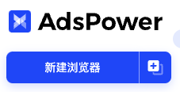
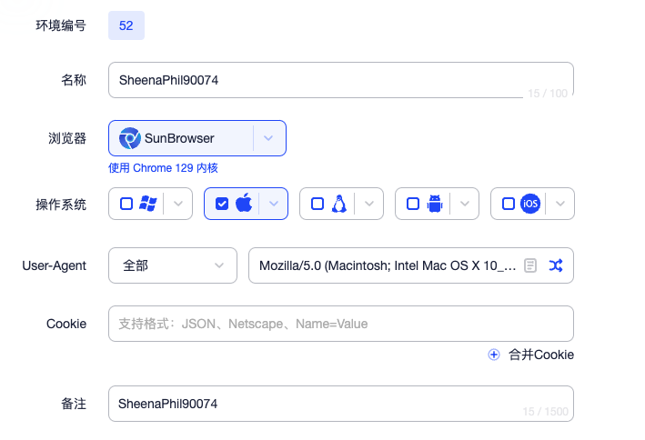
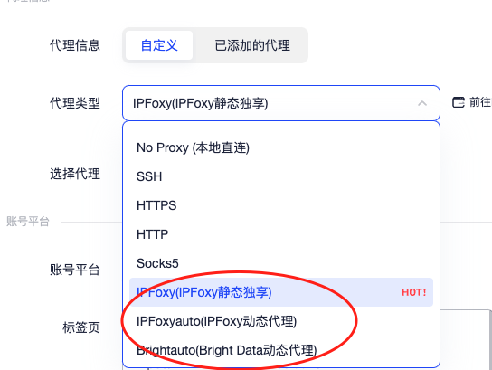
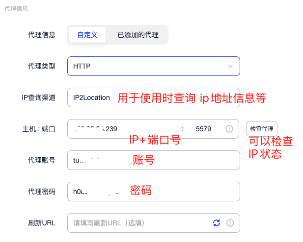
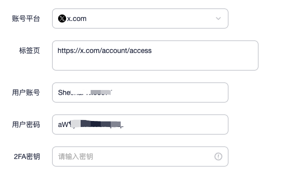
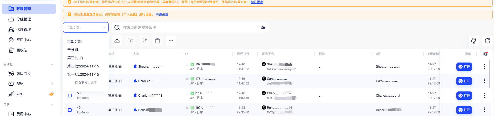
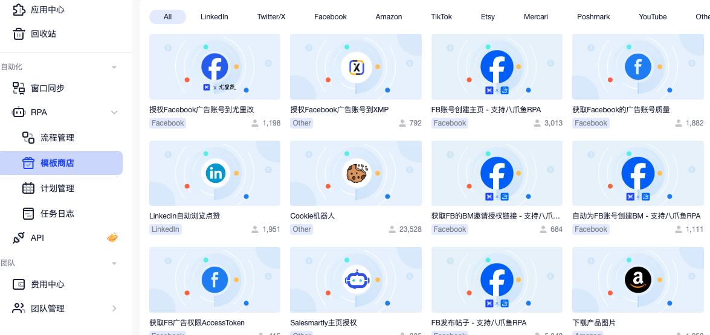
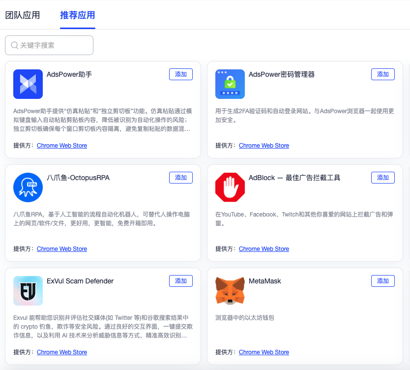
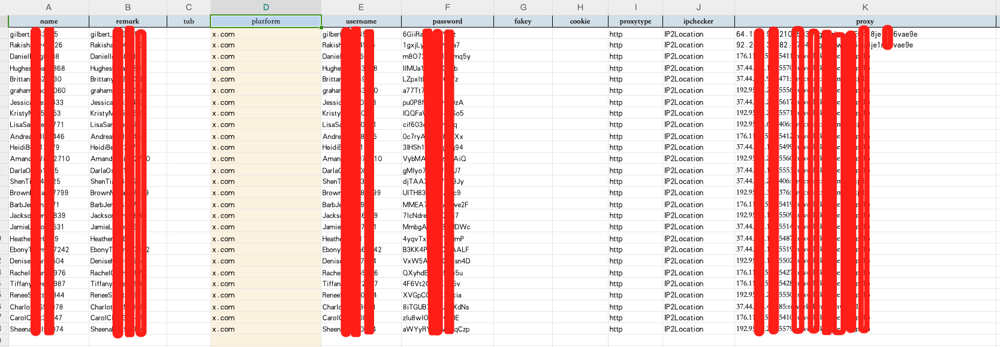

Hello，大家好，我是Momo。最近在整理一些撸毛相关的知识写成笔记，把一些自己认为有价值的东西分享给大家，希望有志同道合的朋友一起学习讨论，也请大神们多多指教。

推特：[@0xMomo](https://x.com/0xmomonifty) | 社区：[Telegram](https://t.co/JQ78TtwxeJ)

0x4系列是撸毛相关知识，也会同步一些近期热门项目来跟大家一起博取空投，文中如有错误请多指点。

本系列所有代码和教程也会开源在Github:https://github.com/0xMomo-NGClubs/Web3-Learning

0x00 IP代理、小号购买推荐

IP代理：
[webshare](https://www.webshare.io/?referral_code=y8bssfgni4o1)
这家我经常用，25个数据中心IP大概14U/月，性价比更高
[Войти](https://panel.proxyline.net)
1.8U/IP/月，性价比也非常高

账号购买：
[web3serve](https://web3serve.shop?from=7281)
[wuyo](http://wuyoo.top?from=9594)

以上都是我常用的，有兴趣的可以自行去了解，因为每个项目对于每个人的使用方法、想法都不同，所以这这里Momo还是提示一下风险，请谨慎使用。

0x01 什么是指纹浏览器以及优势

指纹浏览器（Fingerprint Browser）是一种专门设计用来模拟不同用户特征的浏览器，主要用于防止网站的反爬虫和和反女巫检测.它可以修改和伪装浏览器指纹信息，使每个会话看起来都像是来自不同的真实用户。并且可以进行多账号管理、IP代理切换、Cookie分组管理、地理位置伪装、时区修改等功能。

在Web3交互中，指纹浏览器使用主要有以下几个原因：

1.可以用来防止被项目方检测到是同一个用户、同一个钱包地址，从而防止被项目方被女巫而无法获取空投。
2.同比多台电脑多台手机，省去大量硬件成本，并且操作起来更加方便。
3.多账号管理方便，并且无需花费更多的时间成本去学习，或者需要更多的技术去维护管理。

0x02 市面上常见的指纹浏览器及选择

AdsPower
BitBrowser
Multilogin
MoreLogin
…

目前市面上指纹浏览器其实有很多，各家的功能和价格都不一样，这里就不一一列举了，有兴趣的可以自行去了解。

我这里以我常用的AdsPower为例，给大家介绍一下指纹浏览器的基本使用。（目前为止非广，放心食用）

注册下载链接：https://share.adspower.net/cS0wS8

0x03 使用方法

1. 创建环境

注册安装后，新用户都会有5个免费环境，可以用来测试使用。

我们点击左上角的 新建浏览器 来创建浏览器环境。

2. 环境设置

浏览器基本配置可以根据当前环境进行设置

3. 代理信息可以填写自己的代理，也可以使用AdsPower自带推荐的代理商，可以前往购买，也可以用我前文推荐的代理商。

4. 平台账号

这里可以填写推特、Telegram、Discord、Github等账号，用来进行账号绑定，方便后续使用时可以让浏览器直接自动填写账号信息登录，省去了来回复制粘贴的麻烦。

5. 指纹配置

在这里可以详细设置浏览器的真实参数，比如浏览器地理位置，语言，时区，字体，分辨率，硬件信息等

最好设置为平时用户操作的参数，这样可以让浏览器看起来更加真实。

最后确定创建，等待环境创建完成~~。

6. 环境管理

在环境管理中，可以查看当前环境的状态，包括浏览器指纹信息，IP地址，代理信息，平台账号信息等。

在分组管理中，可以对当前环境进行分组管理，方便后续使用时可以快速找到对应的环境。

并且我们可以在搜索中可以根据环境名称、平台账号等信息进行搜索，方便快速找到对应的环境。

7. 环境使用

单个浏览器环境在环境管理中，我们可以点击右边的 打开，进入环境，进行使用。

也可以在环境管理中，点击右边的 批量打开，进入环境，进行使用。

批量打开后，会弹出多个浏览器环境，我们可以使用窗口同步，来同步多个浏览器环境，一键排列，文本管理（查询空投的时候很好用）等

8. 其他

adsPower还有很多其他功能，比如：

RPA，他是一个自动化工具，可以用来自动化执行一些重复性操作，可以在他的模板商店查找使用来学习。

应用中心，可以批量设置浏览器的插件，比如常用的钱包插件，Cookie插件，代理插件等。可以复制谷歌商店的插件地址，也可以自己上传插件，也可以直接在推荐应用中选择。

批量新建浏览器，在付费版本中，可以批量新建浏览器，并使用Excel模板表格批量导入环境信息（环境拼成、IP代理、平台账号），方便快捷，适合多账号的撸毛小伙伴使用，参数跟单个新建浏览器差不多，这里就不详细介绍了。

# 0x04 总结

以上是对AdsPower指纹浏览器等相关教程，希望对大家有所帮助，如果有什么问题，欢迎大家一起讨论。