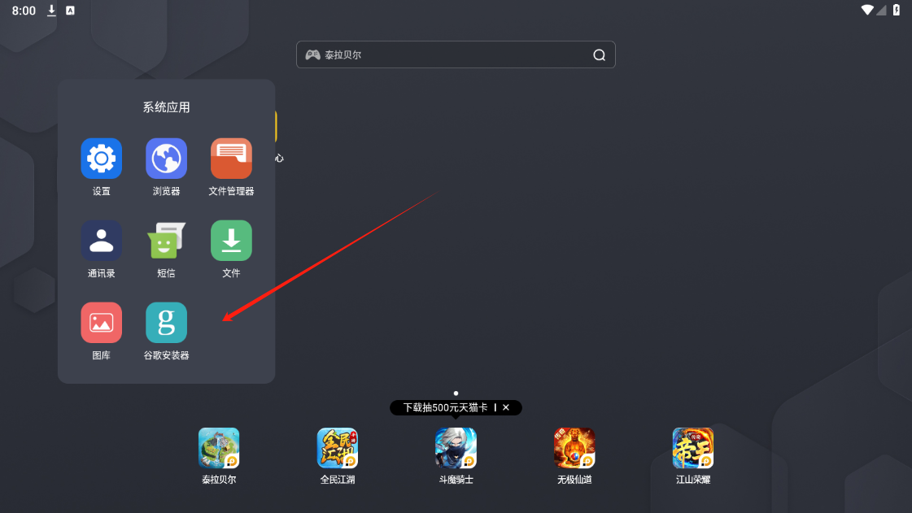

Hello，大家好，我是Momo。最近在整理一些撸毛相关的知识写成笔记，把一些自己认为有价值的东西分享给大家，希望有志同道合的朋友一起学习讨论，也请大神们多多指教。

推特：[@0xMomo](https://x.com/0xmomonifty) | 社区：[Telegram](https://t.co/JQ78TtwxeJ)

0x4系列是撸毛相关知识，也会同步一些近期热门项目来跟大家一起博取空投，文中如有错误请多指点。

本系列所有代码和教程也会开源在Github:https://github.com/0xMomo-NGClubs/Web3-Learning

## 0x00 前言

本期文章主要是对手机项目撸毛的一些想法思路的分享，因为之前有很多比如TG内的各种小游戏（如：仓鼠、Blum、Catizen等）需要手机上才能玩，如果遇到这些手机项目，我们该如何获得更多的空投。

在Momo进入Web3之前，也做过一些手游打金搬砖，公司里也做过一些自动化触达项目，所以对于手机项目撸毛，我这里从如何多开、IP代理、群控、自动化脚本等方面来跟大家分享。内容可能会稍微涉及一些专业方面，但是也希望一些还未对这一块了解的朋友能够知道一些这方面的东西，能够面对手机项目撸毛会有一定的方向来入手。

## 0x01 多开撸毛

1. 手机模拟器

手机模拟器是能够模拟手机环境，在电脑上运行多个安卓系统的软件。市面上比较常见的有：雷电、夜神、逍遥、MuMu、网易MuMu、腾讯手游助手等。一般工作工作室用的较多的是雷电模拟器，https://www.ldmnq.com/。
模拟器一般都自带同步器、脚本录制、多开、IP代理等功能，所以对于多开撸毛来说，模拟器是一个不错的选择。涉及到需要交互x、discord、telegram等社交软件，可以先安装谷歌安装器安装三件套。

用来多开安卓模拟器的电脑需要有多线程的大内存的主机，一般市面上会以洋垃圾E5系列+华南主板为主,直接淘宝搜索相关关键词即可，或则直接搜游戏工作室主机。

2. 主板机

一般游戏等工作室为了达到手机的真实性，会使用主板机来跑一些游戏、抖音、小红书等软件。咸鱼里面就可以直接搜主板机，大部分都是以三星手机系列主板为主，你可以理解为去除了电池、屏幕、摄像头等硬件，只保留了主板，然后通过USB连接电脑，由电脑来控制手机。

主板机控制软件市面叫投屏软件，这里推荐两款常用的 
来喜投屏 [https://www.laixi.app/?lang=zh-CN](https://www.laixi.app/?lang=zh-CN)，大部分功能收费，但是功能强大，业内最常用的一款
效卫投屏 [https://xiaowei.run/](https://xiaowei.run/)，免费，但是功能足够用，可以满足大部分需求

## 0x02 IP代理

1. 手机模拟器的话，可以直接使用像clash、v2ray等代理软件，然后设置代理IP，就可以直接使用。如果进阶一点可以使用类似 有米代理软件 [http://youmiip.com/](http://youmiip.com/)，窗口绑定唯一IP，更加个性化一点.

2. 主板机的话，可以可以购买市面上一些多WIFI的ros软路由，他可以集成多个WIFI，每个wifi可以设置不同的IP，然后通过主板机来连接wifi，这样就可以实现每个手机一个IP，还是比较硬核，但是 市面上的ros软路由，ip好像要客服来绑定，也不是很自由。

如果自己有一定的技术，可以自己来做socket代理+虚拟机软路由，主板机直接通过dhcp获取IP，由虚拟机软路由来分配路由跟代理。这一块Momo后来没有去实现，但是许多工作室都是这么做的，小伙伴们可以自行研究一下。

## 0x03 自动化脚本

市面上安卓自动化脚本有很多，需要一定的编程能力，比如

1. JavaScript系列的Autojs,因为压力不更新了但是可以使用fork版本：[http://doc.autoxjs.com/#/](http://doc.autoxjs.com/#/)

2. 中文强大的 按键精灵 [http://m.anjian.com/](http://m.anjian.com/)，如果不会编程，可以学习一下按键精灵，中文界面友好。

3. 或者我使用较多的 airtest [https://airtest.netease.com/](https://airtest.netease.com/)，它是一款基于python的自动化测试框架，可以用来做安卓自动化测试，也可以用来做安卓自动化脚本。当然也要熟悉adb命令，有了adb，模拟器和主板机都适用。

## 0x04 总结

以上是Momo结合自己之前多开群控的一些经验，也同样可以运用到手机项目撸毛中，有什么问题大家也可以一起留言交流。