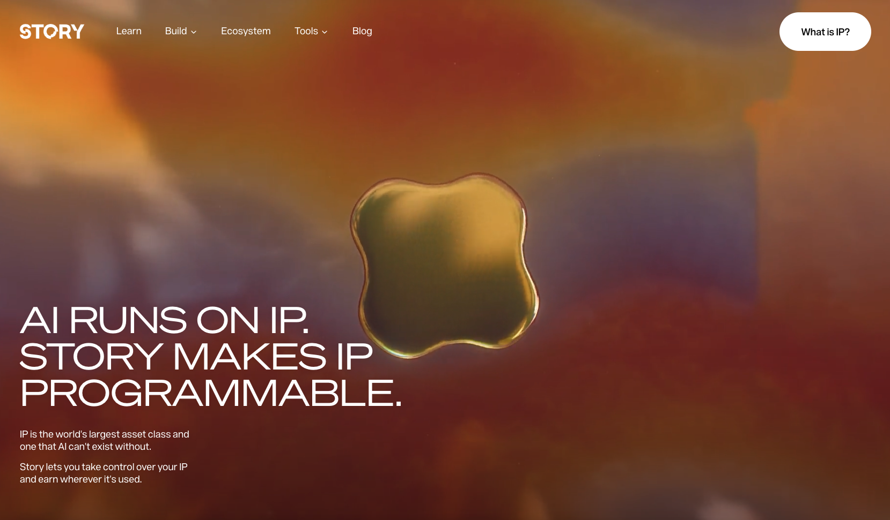
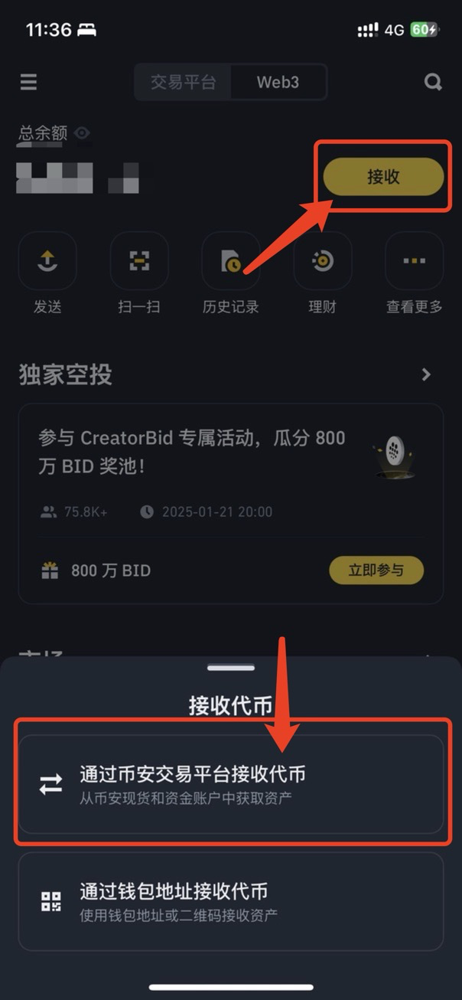
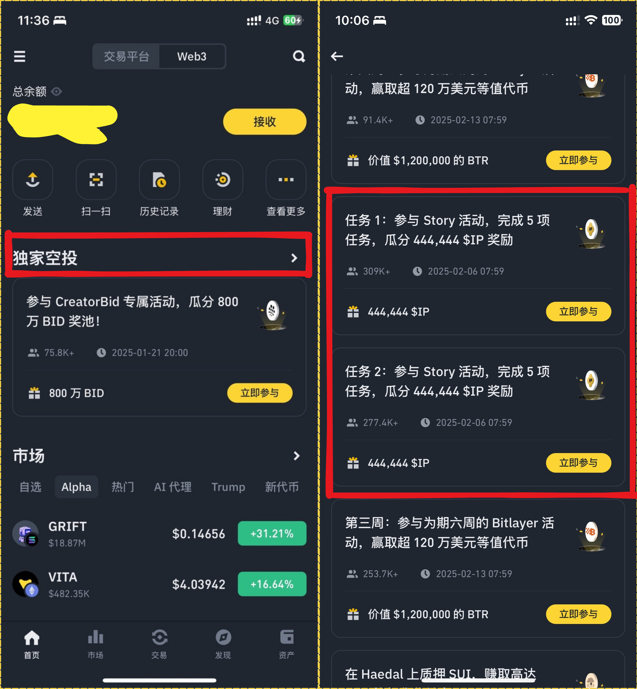
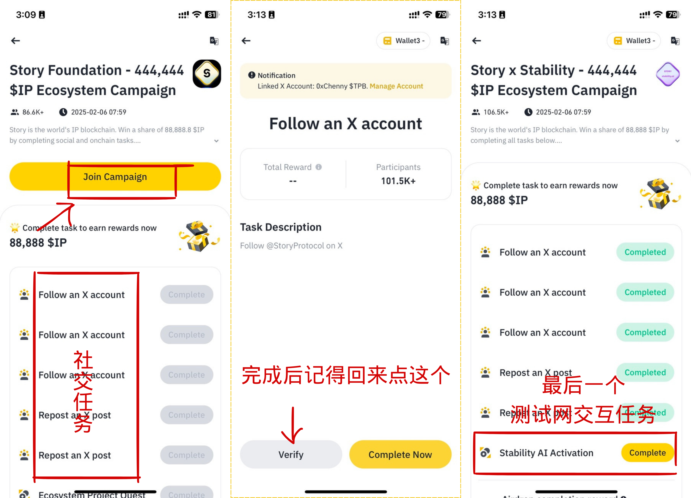
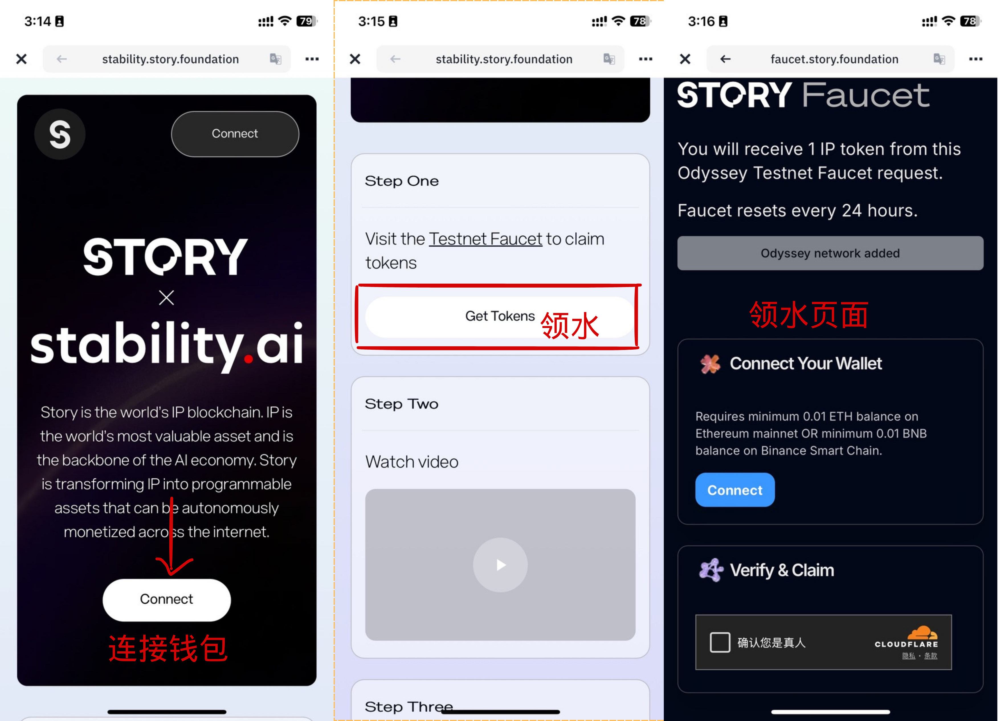
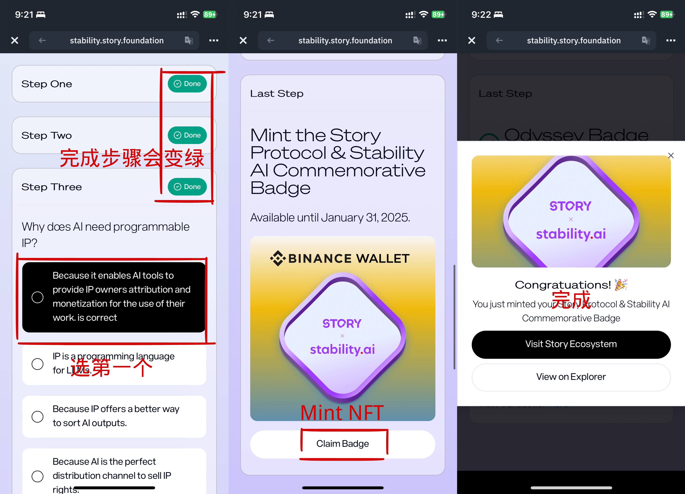
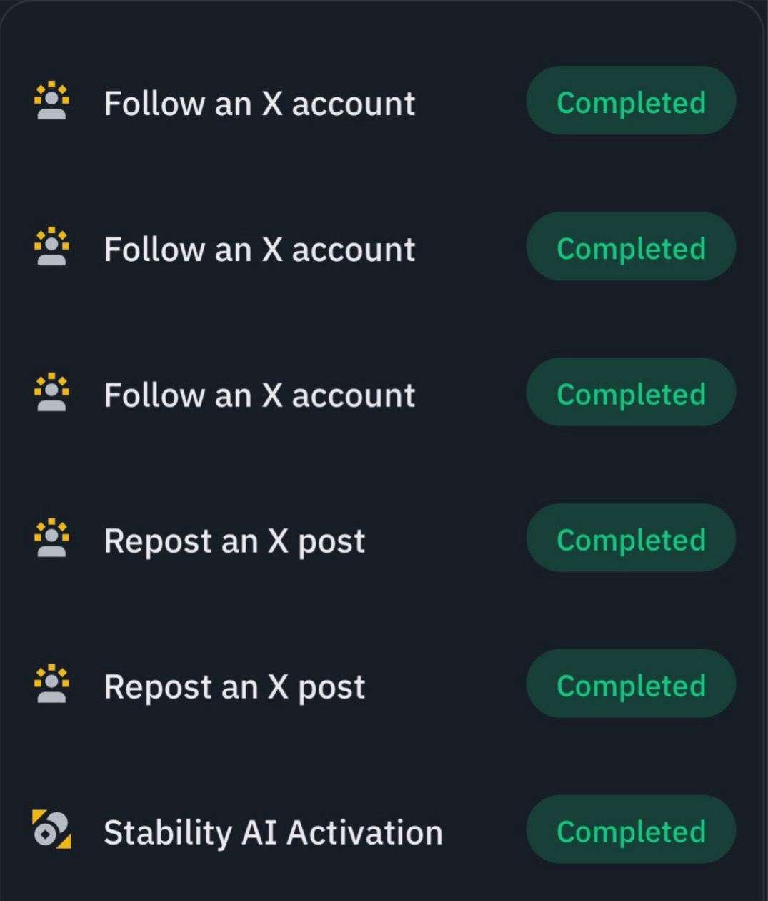
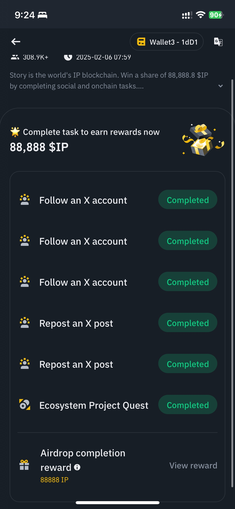
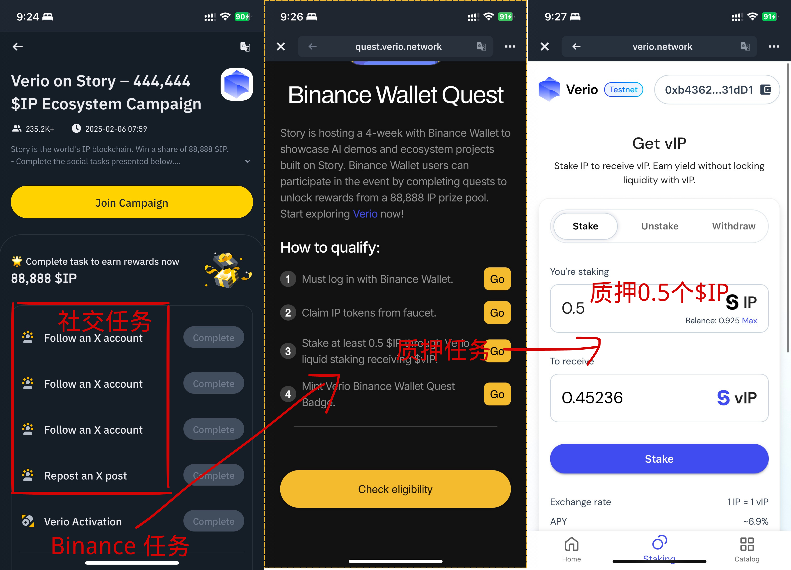
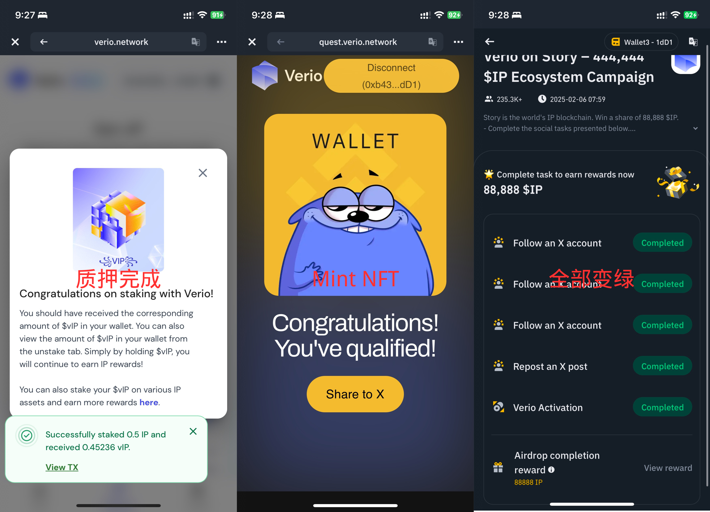

Hello，大家好，我是Momo。作为一名区块链技术学习者，我将把学习过程中的心得整理成文章与大家分享。本期Momo将给大家带来Story Protocol 和 币安Web3钱包联合发起的空投任务教程。

# 0x00 Story 简介

**Story Protocol** 是一个基于区块链的去中心化协议，专注于知识产权（IP）的管理与扩展。它通过将创作者的内容或故事上链，确保所有权透明且不可篡改，同时支持多方协作和二次创作。智能合约简化了授权与收益分配流程，让创作者更高效地开发和保护自己的 IP。

核心特点包括：

- 版权保护：记录原创内容所有权，防止侵权。
- 协作透明：多方贡献清晰可见，公平分配收益。
- IP 扩展：支持跨媒介授权与二次创作。
- 激励机制：为创作者和社区提供奖励。

Story Protocol 为创意经济提供了一个创新解决方案，赋能创作者，同时推动内容协作与传播。

# 0x01 活动交互教程

Story生态交互非常强大，测试网也快来到了最终阶段，许多项目交互非常值得去做，这次Momo主要是讲解一下 最新的 Story & 币安Web3钱包联合发起的空投任务教程。

1. 首先我们需要准备0.01个$BNB在BSC链上，因为Story任务时领水需要BSC链上有BNB，否则无法领取。如果没有我们直接在交易所购买现货 0.01个$BNB，然后我们直接在币安APP点击[资金]->[Web3]切换到Web3钱包界面，如果还没有钱包的小伙伴首先要创建好钱包哦！点击[接收]，选择[通过币安交易平台接收代币]直接从交易所传过来0.01个$BNB（如有请跳过）。

2. 我们来到币安钱包首页 -> 点击[独家空投] -> 下拉选择[Story 的活动] ，目前有三个，分别有 ”任务1“、”任务2“、”任务3“。

为了方便”任务一“的最后的认证，我们先从”任务2“开始，点击[任务2]，然后点击[Jion]开始参加活动任务。前五个位推特社交任务，我们一次点击[Complete]连接推特，完成相应的关注，转发等任务后返回进行[Verify]审核确认。

3. 完成社交任务之后，最后一个任务是Story X Stability AI测试网交互任务，我们点击[Complete] -> [Complete Now]，来到Stability AI测试网交互任务页面，我们点击[Connect]连接钱包，依次完成[1.领取水]、[2.看视频]、[3.答题选第一个]、[4.Mint NFT获得徽章]，完成后返回点击[Verify]审核确认。

到此全部变绿，我们完成了”任务2“中的所有任务。

4. 完成”任务2“之后，我们点击[任务1]，点击[Join]开始参加活动任务。跟”任务2“一样，前五个位推特社交任务，我们依次完成后，最后一个任务如果”任务二“完成了，那么我们直接进行[Verify]审核确认即可完成”任务一“的所有任务。

5. 之后我们点击[任务3]，点击[Join]开始参加活动任务。同样我们完成前5个推特社交任务后，最后一个任务是Binance 的Story活动任务，我们依次完成[1.连接钱包]、[2.领取水]、[3.质押0.5个$IP]、[4.Mint NFT徽章]，完成后返回点击[Verify]审核确认。到此，我们完成了”任务3“中的所有任务。

# 0x02 总结

Story Protocol作为一个创新的区块链IP管理协议，为创作者提供了强大的版权保护和协作工具。本次币安Web3钱包联合Story Protocol推出的空投任务，包含了三个主要任务，通过完成这些任务，用户不仅能够深入了解Story Protocol的生态系统，还能获得潜在的空投奖励。如果文章对你有帮助，记得点赞收藏关注我哦！
