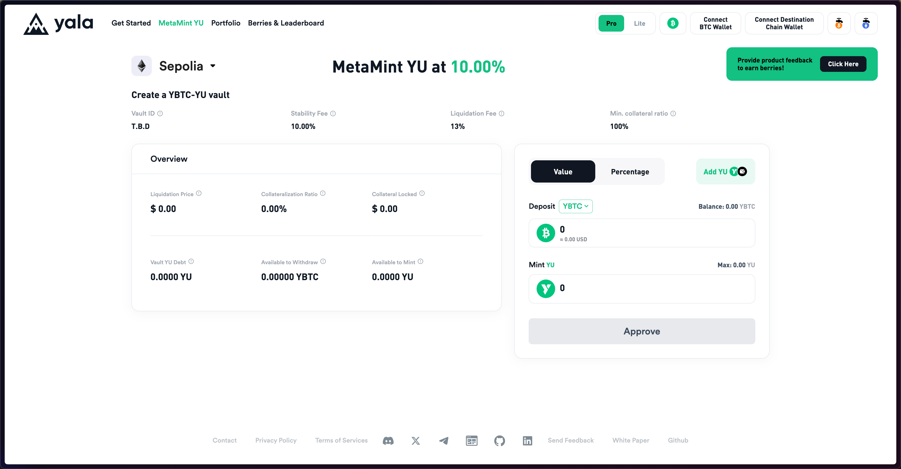
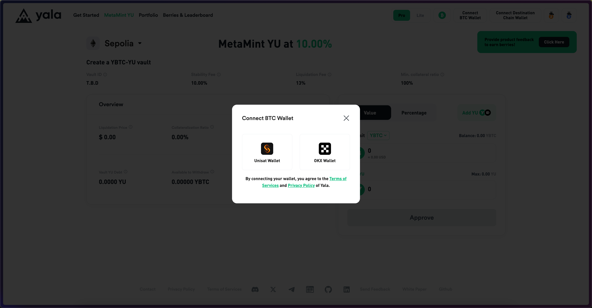
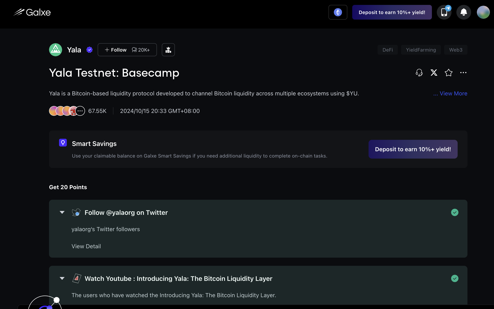

# 0x00 Yala简介

Yala 是一个比特币流动性协议和稳定币发行平台，用户可以通过测试网交互存入 MetaMint YU、管理头寸并质押 YU 来赚取积分 BERRIES。这些积分预计将在主网上线及治理代币发布时具有一定的价值。

目前 Yala 正处于测试网阶段，用户可以通过签到、质押以及增加流动性等方式获得 BERRIES 积分。此外，参与测试网活动还可以帮助用户熟悉平台功能，为未来主网的使用做准备。

# 0x01 测试网教程

测试网的任务非常简单，主要是进行领水 -> 铸造$YU代币 -> 质押$YU代币 -> 每日签到 -> 银河任务

1. 连接钱包：首先我们打开 Yala 测试网：https://app-testnet.yala.org?inviteCode=ExHVwqnCDN，在左上角连接好BTC和EVM钱包，为了方便“多网畅联”我们可以直接使用OKX钱包。连接钱包即可获得 10 个浆果

2. 领水：然后我们点击右上角[BTC水龙头]和[ETH水龙头]，点好验证码变为绿色钩钩，点击[Submit]。这里需要等待较长时间，BTC网络是比较慢的，如果领取失败可以尝试领水页面下面的其他水龙头网站进行领取。如果领不到水请直接留言，如果我还有余额我投给你。
![[提升/区块链/推特/推文/0x4/0x4004/image-2.png]](./img/image-2.png)

3. 兑换YBTC：然后我们回到首页，根据Get Started步骤提示绑定好钱包，一步步来到存入tBTC，点击右上角[绿色BTC]按钮，存入至少0.0002个tBTC兑换成YBTC，确认交易后稍等区块打包。每存入 0.001 BTC 获得 24 个浆果，24 小时后奖励。
![[Pasted image 20250203233550.png]](./img/Pasted%20image%2020250203233550.png)

4. 使用YBTC兑换$YU代币：然后我们点击屏幕上方[MetaMint YU]，在表单里填好兑换数量，点击[Approve]进行批准、确认钱包交易情况进行兑换，注意这里需要测试网SepoliaETH作为GAS。每小时赚取 0.05 个 Berries。
![[Pasted image 20250204103649.png]](./img/Pasted%20image%2020250204103649.png)

5. 质押 $YU代币：点击[Portion]———  Stake LP Token 可以结合YBTC进行质押，每$YU 赚取 0.04 Berries/小时

6. 签到：点击[Berries & Leaderboard]右边可以进行每日签到，每天获得 1 个浆果。 ![[Pasted image 20250204220840.png]](./img/Pasted%20image%2020250204220840.png)

8. 银河任务：Yala也有银河任务，可以直接在Galxe中搜索，其中选择题答案是baaaac。

8. 首页Get Started也有些任务可以获得Berries，可以完成它。

# 0x02

本次Yala测试网主要是通过完成任务、质押代币、参与推荐计划等方式赚取 Berries，预计在 Yala 主网上线后可以转化为奖励。

这个项目本质上是试图解决比特币在DeFi领域应用受限的问题，通过创新的稳定币机制来释放比特币的流动性价值，使其能够更好地参与到更广泛的区块链生态系统中。