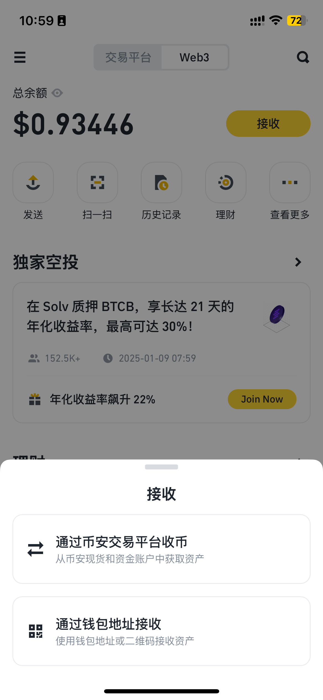
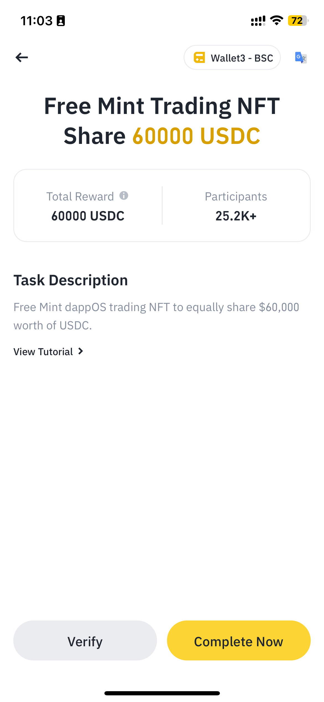
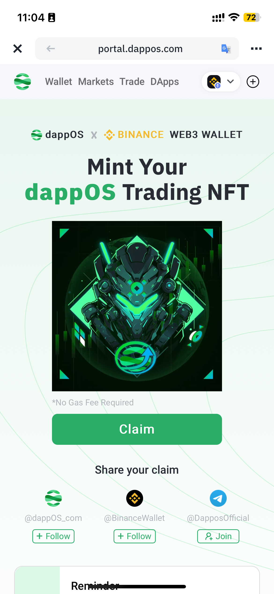
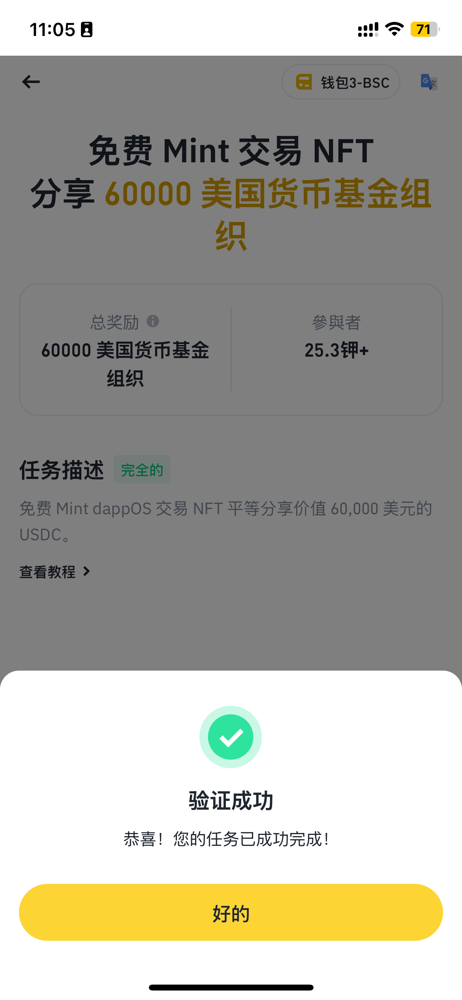
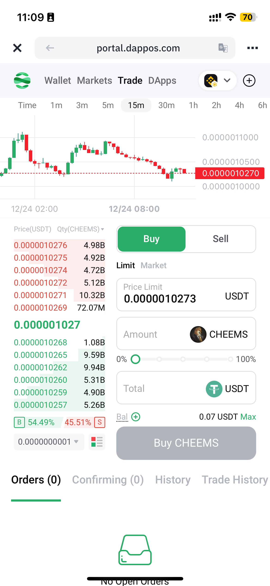
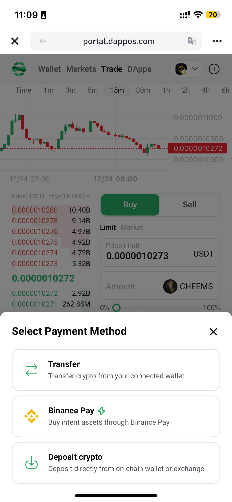
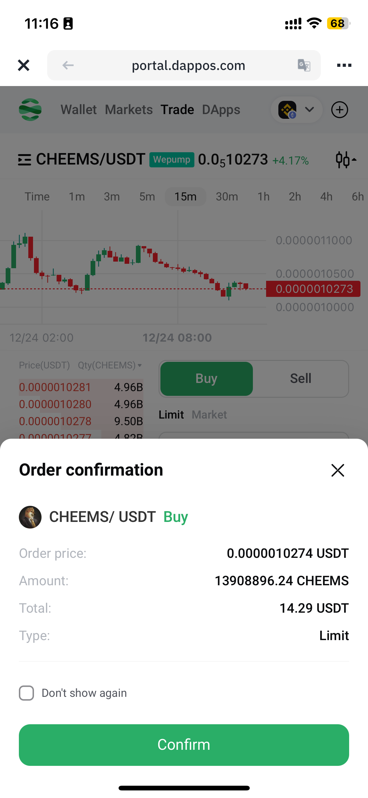

Hello，大家好，我是Momo。最近在整理一些撸毛相关的知识写成笔记，把一些自己认为有价值的东西分享给大家，希望有志同道合的朋友一起学习讨论，也请大神们多多指教。

推特：[@0xMomo](https://x.com/0xmomonifty) | 社区：[Telegram](https://t.co/JQ78TtwxeJ)

0x5 系列是对目前热点项目的学习、使用、总结分享。结合自己的白话文让大家更加简单快捷的了解项目并参与其中，所以一下内容分享均为自己的理解认知，如有问题与错误请谅解并与我联系及时更正！

本系列所有代码和教程也会开源在Github:https://github.com/0xMomo-NGClubs/Web3-Learning

## 0x00 前言

在现在的多链时代，在Web3进行交互如何变得更简单十分重要，意图届的王者非dappOS莫属，它让用户与链上应用的交互变得更简单、更直观。而最近继 IntentOS 之后，dappOS 推出了现货交易平台 IntentEX，进一步完善了其生态系统，致力于简化用户交互并提供高效执行能力。旨在为用户提供接近中心化交易所（CEX）级别的交易体验。

之前Momo参与过dappOS 的每一期 Intent dApps，其中有很多知名的去中心化交易平台，如：GMX、KiloEx、Aark等，在dappOS的加持下，用户可以无视区块链网络之间的隔阂，专注于交易，无需其他鼓励，操作变得非常丝滑，而且dappOS对于每一期 Intent dApps体验都可以从中获取到丰厚的奖励，体验感也是非常爆炸！

这一次 dappOS 带来了更加重磅的 IntentEX 现货交易平，**IntentEX 的革新之处在于其能够为用户带来接近中心化交易所的交易体验，同时降低成本并提升速度。**

所以，接下来Momo用自己的白话文来大家来熟悉一下IntentEX，并且跟大家一起参与一下 币安Web3 钱包最新的交互活动！

## 0x01 IntentEX&dappOS

1. 意图就是用户指定他们想要实现的目标（例如，转移资产），而无需处理细节。代理（即求解者）处理这些请求，提供快速高效的服务。就好比我想要从以太坊主网（L1）向Optimism发送一些ETH，在没有意图操作的情况下，我需要了解如何桥接资产、支付高昂的gas费用以及等待交易确认。但是在dappOS的意图网络下，不需要关心复杂的跨链操作细节，只需要在dappOS的钱包中点击 Withdraw 即可，dappOS和背后的智能合约会处理剩下的所有事情。这就是意图操作的核心思想：用户只需关心他们想要的结果，而具体的实现细节则由系统自动完成。

2. IntentEX 是最近dappOS在IntentOS之后推出的现货交易平台，他与appOS 的意图操作系统（IntentOS）和意图资产（Intent Asset）协同工作，实现了操作和资产的意图化。在当前加密货币市场新资产和 MEME 打狗季的涌现激发了用户对链上交易的强烈需求。然而，现有链上交易平台(DEX)常常因流动性不足、交易延迟和高费用而受到诟病，这些问题严重制约了用户体验的提升。最主要的根本问题在于在多链时代的背景下，代币的流动性在不同交易平台间的分散，是的用户交易很难在一个DEX之类的平台上进行兑换操作。
3. dappOS意图优势来了，它通过 IntentEX 提供了一种全新的交易模式，有效解决了流动性、成本和效率的问题，使用户能够实现交易的意图。IntentEX 的创新之处在于将用户的限价单视作任务，由 dappOS 网络中的节点负责执行，这些节点能够在各个区块链上进行交易。用户在 IntentEX 上下达限价单即发布任务，网络中的节点会根据保证金、成本、速度等因素匹配最合适的服务节点。服务节点承诺成交一定数量的订单，并通过 dappOS 的 OMS 机制 （**乐观最小质押（OMS）机制**）确保承诺的履行。这不仅提高了订单的成交速度，还减少了用户的等待时间。![[Pasted image 20241224104716.png]]
4. 概念这么复杂，能不能再直白一点？好！

如上图，比如Momo在dappOS上的Trade点击Buy下单（即在 IntentEX 上下达限价单即发布任务），网络中的节点会根据保证金、成本、速度等因素匹配最合适的服务节点并反馈给用户，待用户签名后服务节点承诺成交一定数量的订单，并通过 dappOS 的 OMS 机制 （**乐观最小质押（OMS）机制**）确保承诺的履行。

## 0x02 参与钱包交互活动

上面说了这么多，那我我们接下来来参与一下 币安Web3钱包 的最近活动（dappOS）会更加直观一些！并且会获得丰厚活动奖励！

1. 在 币安 APP中点击 资金 -- Web3 切换到 Web3钱包界面，如果还没有钱包的小伙伴首先要创建好钱包哦！开始之前我们需要准备好交互金额，如果钱包小于10U的话可以点击 接收--通过币安交易平台收币 直接方便快捷的转入金额到钱包，而且现在转BSC链都是0手续费哦！！注意转入最好超过11U确保交互中的摩擦和手续费，并且钱包要有预留一些链上手续费转入dappOS哦。

3. 点击钱包首页的独家空投，选择 dappOS 的活动即可进入活动页面，我们点击 Join 参与活动！
4. 第一个NFT Mint任务进入并且链接币安钱包进行交互，免费Mint一个NFT，有机会获得60,000的USDC喔！完成后返回记得要点击 核实，在活动页面单项任务按钮变绿才算完成，下面也是一样哦。

5. 第二个任务点击进入dappOS 的Trade交易页面交易任意代币，如果没有USDT的话点击Bal转入钱包金额到dappOS钱包，这里Momo发现居然还直接支持binance pay ， 还是相当方便！转后我们交易大于10U，即可完成这项任务。交易过程跟币安交易一样快捷，非常的快和丝滑！~ （这里主要得益于 dappOS 意图执行网络的专业服务节点在opBNB链进行结算）

6. 第三个任务就是跟刚才一样，但是需要交易 $CHEEMS 代币，我们同样进行操作即可。记得返回验证。

7. 第四个任务就是跟上面一样，但是需要交易 $GOAL 代币，我们同样进行操作即可。记得返回验证。
8. 这样全绿我们就完成交互啦！

## 0x03 总结

我们体验下来 **IntentEX 的优势** 非常明显，主要体现在一下几个方面：
1. **市场流动性**：dappOS 的节点能够实时匹配全市场的订单，提供优越的流动性。

2. **执行快、成交快**：利用市场流动性，得益于 dappOS 意图执行网络的专业服务节点在opBNB链进行结算，IntentEX 提供快速的成交服务。

3. **低成本交易**：依托于 dappOS 专业的服务节点网络和opBNB高速低费的特点，使交易成本仅为0.1%。

4. **透明去中心化**：所有交易记录在链上，确保透明性和可靠性。

IntentEX 作为 dappOS 生态中重要的一部分，在成功实施以意图为中心的操作和资产之后，dappOS 引入了 IntentEX 以促进用户进行以意图为中心的交易。此外，IntentEX 上的主流资产如 USDT、BTC 和 ETH，作为 dappOS 的意图资产，为用户提供了非交易状态下的利息收益且不会妨碍立即使用这些资产进行交易。

通过这种方式，dappOS 不仅为用户带来了更便捷的交易体验，也为 Web3 的发展注入了新的动力。并且这次intentEX采用opBNB区块链网络进行结算，也是dappOS全面融入BNB Chain生态的一个标志。👏