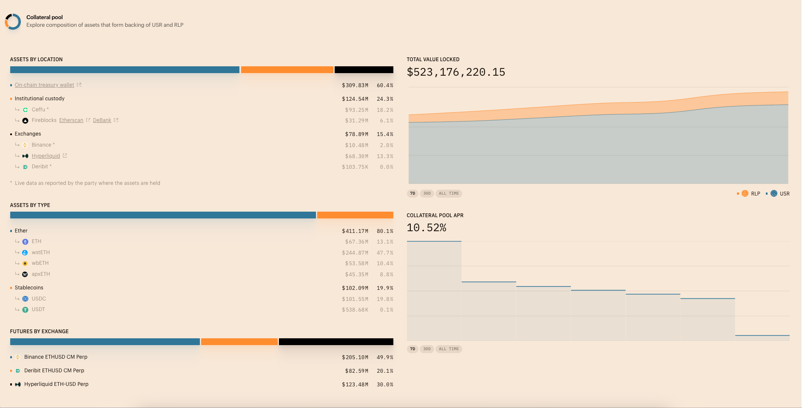

Hello，大家好，我是Momo。最近在整理一些撸毛相关的知识写成笔记，把一些自己认为有价值的东西分享给大家，希望有志同道合的朋友一起学习讨论，也请大神们多多指教。

推特：[@0xMomo](https://x.com/0xmomonifty) | 社区：[Telegram](https://t.co/JQ78TtwxeJ)

0x5 系列是对目前热点项目的学习、使用、总结分享。结合自己的白话文让大家更加简单快捷的了解项目并参与其中，所以一下内容分享均为自己的理解认知，如有问题与错误请谅解并与我联系及时更正！

本系列所有代码和教程也会开源在Github:https://github.com/0xMomo-NGClubs/Web3-Learning

## 0x00 什么是去中心化稳定币？

去中心化稳定币（Decentralized Stablecoin）是一种基于区块链技术的加密货币，其价值通常与法定货币（如美元）保持1:1的锚定关系。与中心化稳定币（如USDT、USDC）不同，去中心化稳定币不依赖于任何中心化机构来维持其价值稳定，而是通过智能合约和算法机制来实现价格稳定。

去中心化稳定币主要有以下几种类型：
1. 超额抵押型：如DAI，需要用户提供价值更高的加密资产作为抵押物
2. 算法型：如FRAX，通过算法自动调节供需来维持币价稳定
3. 混合型：结合了多种机制，既有抵押物又有算法调节

去中心化稳定币的优势在于：
- 完全去中心化，无需信任第三方
- 透明度高，所有操作都在链上可查
- 无需KYC，人人都可使用
- 抗审查性强，不受单一机构控制

但同时也面临一些挑战：
- 价格稳定性可能受市场波动影响
- 抵押率要求较高，资金使用效率较低
- 系统复杂度高，可能存在安全风险

## 0x01 什么是中性稳定币协议 Resolv

[Resolv App](https://app.resolv.xyz/ref/0xMomo)

Resolv 稳定币协议是一种创新的金融工具，旨在通过 Delta 中性策略实现稳定币的价值稳定。该协议的核心在于构建市场中性投资组合，通过代币化的方式将这一策略转化为可操作的金融产品。Delta 中性策略通过组合多个相互抵消价格变动的金融衍生品头寸，如期权或永续合约，来平衡基础资产价格波动带来的风险，从而在市场动荡时保持投资组合价值的相对稳定。

Resolv 协议推出了两款主要代币：USR 和 RLP。USR 是一种由 ETH 抵押支持的稳定币，其价值与美元挂钩，用户可以通过质押 USR 获得收益。RLP 则充当可扩展的保险层，旨在为 USR 提供额外的市场风险保护。RLP 的价值会根据协议的盈亏情况动态调整，持有 RLP 的用户可以获得更高的利润分配，但同时也需承担相应的亏损风险。

Resolv 的资金运作具有高度的透明度和可追溯性，其资金分布清晰，大部分资金在链上，部分资金存储于中立机构或合作的去中心化交易所，如 Hyperliquid。这种透明的资金管理方式增强了投资者对协议的信任，也为其在市场上的快速发展奠定了基础。自 12 月初以来，Resolv 的 TVL（总锁定价值）实现了显著增长(目前以来到了$523M)，显示出其在稳定币领域的强劲势头和市场认可度。

Resolv 协议主要特点总结（一眼看懂）:

1. 链上可查，透明度高
Resolv协议的所有交易和操作都在区块链上公开记录，任何人都可以实时查看和验证。资金流向完全透明，用户可以随时追踪资金的去向和使用情况

2. Delta中性策略原理优势
协议采用创新的Delta中性策略，通过精心设计的期权和永续合约组合来对冲市场风险。即使在市场剧烈波动时期，该策略仍能保持投资组合的相对稳定。

3. 资产配置优势
Resolv在资产配置方面采取稳健策略，将大部分资金存放在Hyperliquid等知名去中心化交易所，并与多个主流DEX建立深度合作关系。这种合理的资金分布方式既确保了资金的安全性，也实现了风险的有效控制。

4. 双代币设计优势
协议通过USR和RLP的双代币设计，巧妙平衡了稳定性和收益性。USR作为稳定币与美元保持挂钩，为用户提供稳定的价值存储；RLP则作为保险层为整个系统提供额外保护，这种设计能够满足不同风险偏好用户的投资需求。

## 0x02 Resolv在2025年DeFi即将迎来大爆环境下有什么优势

在2025年DeFi即将迎来大爆发的背景下，Resolv稳定币协议凭借其独特的优势，有望在激烈的市场竞争中脱颖而出，成为推动DeFi生态发展的重要力量。

技术创新优势

• Delta中性策略优化：Resolv对Delta中性策略进行了深度优化，使其在应对市场波动时更加精准高效。通过精心设计的金融衍生品组合，如期权和永续合约，Resolv能够有效对冲基础资产价格波动带来的风险，为用户带来稳定的投资回报。这种技术创新不仅提升了协议的抗风险能力，还为用户提供了更加安全可靠的稳定币投资渠道.

• 双代币模型创新：Resolv的双代币模型（USR和RLP）具有独特的创新性。USR作为稳定币，由ETH抵押支持，价值与美元挂钩，用户可以通过质押USR获得稳定的收益；而RLP作为可扩展的保险层，吸收Delta中性策略的风险，保护USR免受市场风险影响。RLP用户可以获得更高比例的利润分配，但也需承担相应的亏损风险。这种双代币模型不仅满足了不同风险偏好的用户需求，还增强了协议的市场竞争力.

资金管理优势

• 透明的资金运作：Resolv的资金管理具有高度的透明度和可追溯性，其资金分布清晰，大部分资金在链上，部分资金存储于中立机构或合作的去中心化交易所。这种透明的资金管理方式增强了投资者对协议的信任，降低了投资风险，吸引了更多的资金流入，为Resolv的持续发展提供了坚实的资金保障.

• 强大的资金支持：Resolv获得了Delphi Labs和Daedalus Angels等知名投资机构的支持，这些机构为Resolv提供了超过2.2亿美元的资金，显示出对Resolv在其领域内强大的资金支持和信任。这种强大的资金支持不仅为Resolv的研发和市场推广提供了充足的资源，还为其在市场中的稳定发展奠定了坚实的基础.

政策与市场环境优势

• 顺应政策趋势：随着全球对去中心化金融的监管环境逐渐明朗化，DeFi行业迎来了更加友好的发展环境。Resolv作为稳定币协议的创新者，其产品和服务符合监管要求，能够更好地适应政策变化，抓住市场机遇，实现快速发展.

• 市场需求旺盛：在2025年，DeFi市场将迎来全面复苏和腾飞，投资者对稳定币的需求将大幅增长。Resolv凭借其创新的技术和优质的产品，能够满足市场对稳定币的多样化需求，吸引更多用户参与，进一步扩大市场份额.

## 0x03 总结

Resolv稳定币协议在技术创新、市场合作、资金管理以及政策与市场环境等方面都具备显著优势，这将使其在2025年DeFi大爆发的浪潮中脱颖而出，成为推动DeFi生态发展的重要力量，为用户带来更加安全、稳定和高效的金融服务体验.