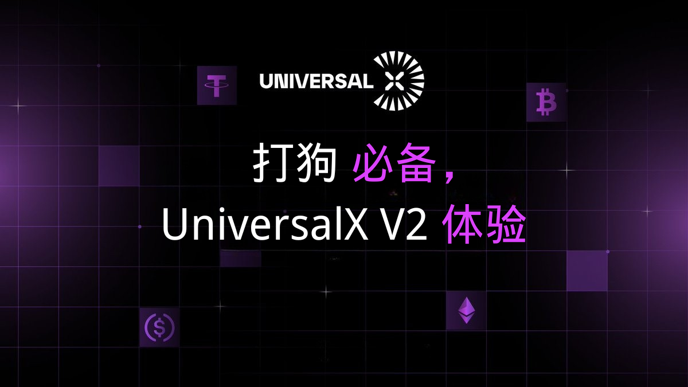

Hello，大家好，我是Momo。作为一名区块链技术学习者，我将把学习过程中的心得整理成文章与大家分享。0x5 系列是对目前热点项目的学习、使用、总结分享。结合自己的白话文让大家更加简单快捷的了解项目并参与其中，所以一下内容分享均为自己的理解认知，如有问题与错误请谅解并与我联系及时更正！

本系列所有代码和教程开源在Github - >【Web3-Learning】

# 0x00 前言

2025年1月18日，美国当选总统特朗普在Solana上正式推出了个人MEME代币——TRUMP。这一事件在加密货币市场引发了轩然大波，TRUMP代币在短时间内迅速崛起，成为市场焦点。许多小伙伴都在第一时间参与了TRUMP代币的Meme热潮，但是因为TRUMP代币的火爆，导致许多小伙伴在第一时间因为钱包在Solana链上没有足够的SOL，导致无法第一时间参与TRUMP代币的Meme热潮。

在这种火爆的市场行情下，许多用户遇到了一些常见的困扰:首先是中心化交易所因为链上交易量激增，导致提币延迟严重，有些用户甚至等待数小时才能完成提币;其次是跨链桥的操作繁琐且耗时，从一条链转移资产到另一条链往往需要等待10-30分钟不等的确认时间，在这期间可能错过最佳的交易时机。这些因素都严重影响了用户参与新项目和把握市场机会的能力。特别是在像TRUMP代币这样的爆发性行情中，几分钟的延迟就可能造成巨大的机会成本。

# 0x01 链抽象助力

在这种情况下，UniversalX的链抽象优势就显得尤为突出。正如我在之前文章中提到的，UniversalX通过其独特的链抽象技术，为用户提供了一个无缝的跨链交易体验。

UniversalX采用"One account, one balance, any chain"的理念，用户只需要管理一个账户就可以在任何支持的链上进行交易。更重要的是，你可以使用任何代币作为Gas费，即使你在目标链上没有原生代币，也能完成交易。这就完美解决了像TRUMP代币这样的突发行情下，用户因缺乏特定链上Gas而错失机会的问题。

UniversalX通过其自身的L1网络进行统一结算，实现了真正的即时跨链。用户无需等待传统跨链桥10-30分钟的确认时间，也不用忍受中心化交易所提币的延迟。整个过程可以用"丝滑"来形容 - 从资金到账到完成交易，真正做到了秒级响应。

UniversalX的非托管性质保证了资产安全，同时还原了类似中心化交易所的交易体验。用户可以轻松调用全链资产，无需考虑繁琐的跨链操作，也不用操心Gas费用问题。这种创新的用户体验，让UniversalX被市场称为"最优秀最丝滑最及时的EVM-Solana资本传输工具"。

简单来说，就算你UniversalX钱包内没有相关代币余额，你也可以直接用法币购买，或者从其他链如Arb、BSC链等转入USDT等相关代币，然后直接在UniversalX上进行Solana链上交易TRUMP代币。冷知识：UniversalX 是唯一一个能让你把 ETH 和 U 直接无缝梭哈到 Solana 上的产品。

# 0x02 UniversalX V2

UniversalX V2 版本带来了一系列重大升级和改进，进一步优化了用户体验：

- 中文语言支持🔥🔥🔥
- 全栈自研紫金 K 线
- 单链执行速度 (如 Solana) 超过大多数 Bot，多链执行速度断层领先
- 扫链 + 全栈自研的 K 线系统，K 线速度快人一步
- Web 端支持多图表视图 (多达 9 个图表同屏查看)，移动端支持多图表左右切换
- 增加中文语言支持

# 0x03 使用体验

1. 进入UniversalX V2 官网，可以看到首页已经焕然一新，点击右上角的语言按钮，选择简体中文，即可看到中文语言支持。整体布局来看，首页设计简洁明了，功能齐全，旨在为用户提供高效便捷的交易体验。

- 顶部导航：提供“首页”、“交易”、“邀请”、“账户”等快捷入口，以及搜索和语言切换功能。
- 账户概览：显示当前余额及24小时变化，附有充值、接收、发送等操作按钮。
- 代币列表：详细列出各代币的实时数据，包括价格、涨跌幅、市值、持有者数量和交易量等。
- 筛选与排序：通过标签和时间范围筛选，帮助用户快速定位感兴趣的代币，以及自己的交易策略。
- 社交集成：每个代币旁边附有社交媒体链接，方便用户获取更多资讯，以及代币的是否存在社交账号信息以便自己的交易思路。

2. 点击上方交易按钮后可以看到非常全面的交易数据和便捷的操作界面，同比常用的gmgn等交易平台，UniversalX V2 的交易数据更加全面，操作界面UI的自研紫金色使得用户可以非常直观的注意自己需要的数据情况。
最重点的点击多表同屏按钮后，可以看到多达9个K线图表同屏查看，点击对应代币的图标即可参与交易，妈妈再也不用担心我错过最佳交易时机了。整体图标使用的是tradingview的，交易体验非常熟悉、丝滑。

3. 在移动端，UniversalX V2 也提供了非常便捷的交易体验，同比dexscreener、gmgn等交易平台，UniversalX V2 的移动端体验更加注重交易，整体UI布局更加直观的体现目前链上的代币数据，以及代币交易操作丝滑体验，当然无须担心跨链等操作问题。

# 0x04 总结

UniversalX的推出，无疑为加密货币市场带来了新的活力。通过其独特的链抽象技术，UniversalX 不仅解决了用户在跨链交易中的痛点，还为用户提供了前所未有的交易体验。

而UniversalX V2 的版本的升级，通过中文语言支持、自研紫金K线、多图表同屏等创新功能的加入，进一步提升了用户体验，让用户能够更加便捷、高效地参与到加密货币市场中。
