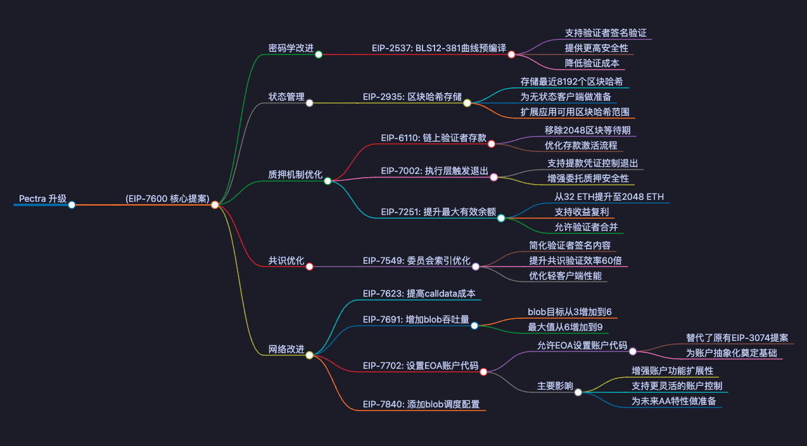

Hello，大家好，我是Momo。作为一名区块链技术学习者，我将把学习过程中的心得整理成文章与大家分享。0x5 系列是对目前热点项目的学习、使用、总结分享。结合自己的白话文让大家更加简单快捷的了解项目并参与其中，所以一下内容分享均为自己的理解认知，如有问题与错误请谅解并与我联系及时更正！
![[提升/区块链/推特/推文/0x5/0x5006/&附件/你的段落文字.png]](./img/你的段落文字.png)
# 0x00 前言

当前 $SOL 热度持续攀升，加上前几天特朗普在Solana上发币 $TRUMP之后，感觉整个世界都在发币，SOL生态的活跃度再度飙升，无论从市场热度还是链上数据看，其表现都可圈可点。而另一边，$ETH 面临较大压力，市场多方涌现的不确定性让人不禁反思：在新一轮技术和市场博弈中，老一辈的ETH究竟该如何自我突破？
本期Momo结合Tim Beiko的文章，带大家来聚焦一下以太坊即将到来的Pectra升级之上，本次升级能够给以太坊生态带来哪些变化，其在重压之下能否带来重大的改变。

# 0x01 Pectra 升级主要功能简述

1. 验证者及质押机制优化

Pectra 升级在验证者和质押机制方面引入了三个重要的改进（EIP-6110、EIP-7002 和 EIP-7251），这些改变将显著提升以太坊质押系统的效率和灵活性：

- EIP-6110：移除验证者存款的2048区块等待期，优化存款流程，使其更加流畅和即时。
- EIP-7002：支持使用以太坊地址作为提款凭证的验证者直接从执行层发起退出，增强委托质押的安全性。
- EIP-7251：将验证者最大有效余额从32 ETH提升至2048 ETH，支持收益复利增长，并允许共享同一提款地址的验证者进行合并。

此次更新主要是改变了单个验证节点可以质押ETH的限制以及质押流程，使得当前很多大户或者项目方需要拆分成很多32ETH节点的用户可以更加方便的进行质押和产生收益，并且提高以太坊的安全性和减少网络延迟。

2. 网络改进

Pectra 升级网络方面主要围绕性能优化和网络安全性展开，使得以太坊虚拟机EVM的执行效率得到显著提升，加快智能合约的执行速度。

- EIP-7623：提高calldata成本，增加calldata使用成本，防止大区块引发网络问题，提升网络长期稳定性
- EIP-7702：设置EOA账户代码，改进账户操作机制，简化未来网络升级，为账户抽象化做准备
- EIP-7691 & EIP-7840：增加blob吞吐量，优化大型数据块处理，blob目标从3增加到6，最大值从6增加到9，提升rollup数据处理效率

这里Momo比较喜欢的是EIP-7702，因为EIP-7702提案主要是为了改进以太坊账户操作机制，为账户抽象化做准备，账户抽象Momo之前在粒子钱包的文章也聊到过，账户抽象化是一个重要的发展方向,它将彻底改变用户链上交易方式，无须考虑主链GAS相关问题，用户不再需要持有ETH 等GAS币才能进行交易,而是可以灵活选择使用USDC、DAI等任意代币支付gas费。这种创新将大大提升用户体验,降低Web3使用门槛。但Momo根据目前进展来看，此项主要还是对抽象做未来准备。

3. 其他改进

除了验证者和质押机制优化以及网络性能改进，Pectra 升级还引入了一些重要的其他改进，这些提案涵盖了密码学、以太坊状态管理和协议效率提升等多个领域，为以太坊未来的发展奠定了重要基础：

- EIP-2537：为以太坊执行层引入 BLS12-381 曲线操作的预编译支持。这一提案允许智能合约验证验证者签名的证明，特别适用于流动性质押或预确认等场景。BLS 提供了更高的安全性和更低的验证成本，是以太坊密码学能力的重要升级。
- EIP-2935：通过将最近 8192 个区块哈希存储在合约中，为以太坊的无状态化转型铺平道路。这不仅扩展了应用程序可用的区块哈希范围（从 256 增加到 8192），还为无状态客户端提供了见证数据支持。
- EIP-7549：优化验证者签名机制，将委员会分配信息从签名中移除。这一改进大幅减少了验证共识所需的加密验证工作量（约减少 60 倍），对轻客户端和未来的零知识证明验证尤为重要。

这些改进虽然不直接面向普通用户，但它们从多个技术层面增强了以太坊的灵活性和效率。例如，EIP-2537 的引入为以太坊密码学能力提供了重要的扩展，而 EIP-2935 则是以太坊迈向无状态化的重要一步，EIP-7549 则显著提升了验证签名的效率。

![[Pasted image 20250124155200.png]](./img/Pasted%20image%2020250124155200.png)

# 0x02 此次升级带来哪些影响

## 对链上用户的影响

- 质押收益更高：如果你参与了以太坊的节点质押，现在你可以通过复利获得更高的收益（质押上限从 32 ETH 提高到 2048 ETH）。这对大额质押者尤其有利。
- 交易更快更便宜：通过优化数据处理方式，这次升级会让网络更高效，交易延迟可能会降低，费用也可能更便宜。
- 改变用户链上交易方式：改进以太坊账户交易操作机制，为其账户抽象化做准备，使得用户降低Web3入门门槛，交易更加的便捷。

## 对节点和验证者的影响

- 验证效率更高：验证者的工作量减少了，减少了验证者签名中需要验证的内容，提升了验证效率，尤其对轻节点和未来的零知识证明验证有重要意义。
- 奖励机制更灵活：验证者的质押上限提高后，允许收益复利，同时还能减少了网络整体验证者的数量。
- 退出更简单：使验证者可以更轻松地退出网络，尤其对托管质押服务和去中心化质押协议意义重大。

## 对以太坊网络（EVM）的影响

- 更强的处理能力：通过引入新的密码学技术（比如 BLS12-381 曲线），以太坊的智能合约可以更快、更安全地验证一些复杂的操作。
- 准备无状态化：升级后，以太坊的状态管理更高效，为未来减少节点存储压力做好了准备。
- 支持更多数据处理：增加网络吞吐量后，以太坊可以处理更多的数据，这对扩容（比如分片技术）非常重要。

# 0x03 总结

Pectra 升级是继以太坊合并之后，以太坊网络的又一次重大升级，它不仅提升了以太坊的性能和安全性，还为未来的网络扩容和无状态化奠定了基础。

以太坊开发团队将这次升级分为两个阶段（Prague/Electra），最快的更新将在2025年年初进行。能否超过 Solana，Momo认为主要取决于用户对速度与去中心化的权衡，以及未来以太坊扩容（如分片技术）的推进速度。

