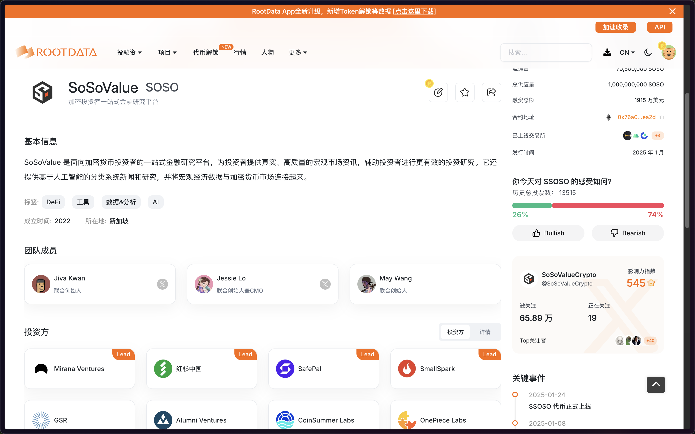
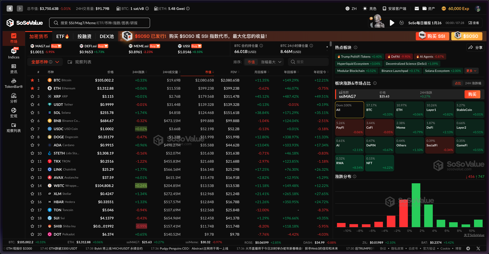
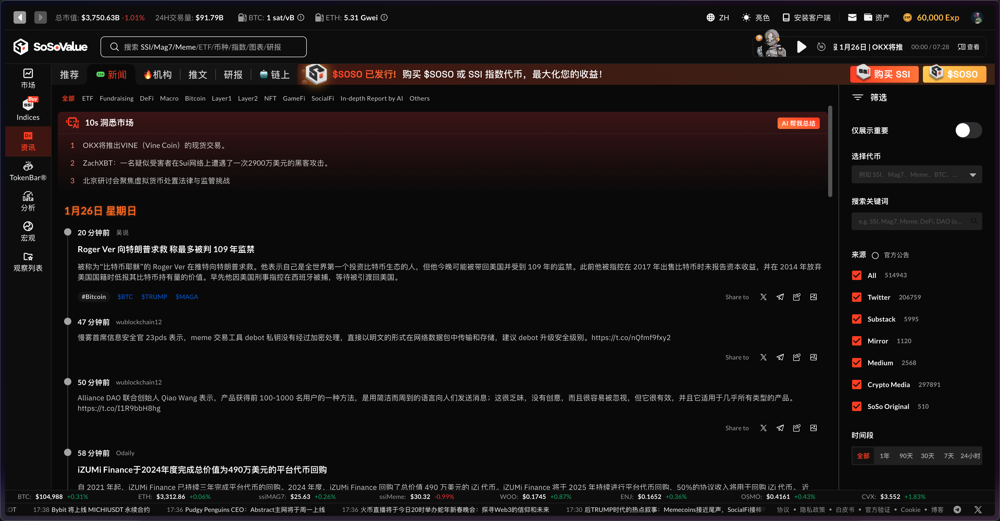
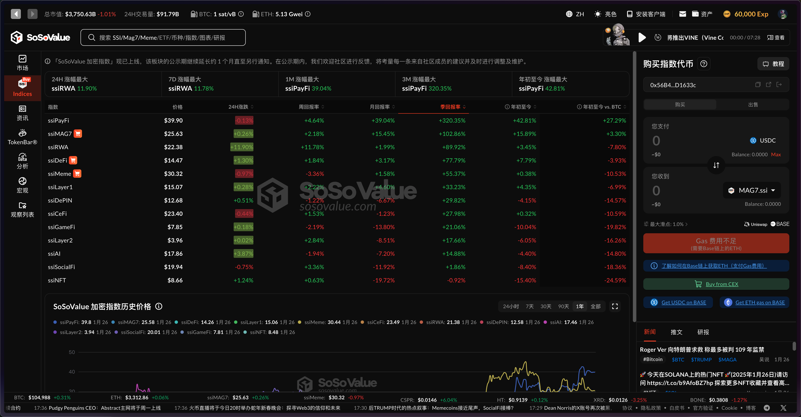

![[提升/区块链/推特/推文/0x5/0x5007/&附件/你的段落文字.png]](./img/你的段落文字.png)
Hello，大家好，我是Momo。作为一名区块链技术学习者，我将把学习过程中的心得整理成文章与大家分享。0x5 系列是对目前热点项目的学习、使用、总结分享。结合自己的白话文让大家更加简单快捷的了解项目并参与其中，所以一下内容分享均为自己的理解认知，如有问题与错误请谅解并与我联系及时更正！
# 0x00 SoSoValue 简介

SoSoValue是一个备受瞩目的AI驱动加密投资研究平台，被业内誉为"链上贝莱德"与"AI彭博"。平台凭借其专业的投研分析工具和创新的链上ETF协议，在短短一年内积累了超过1000万注册用户，日活跃用户突破100万。今年1月，平台完成了由红杉资本和SmallSpark领投的1500万美元A轮融资，估值达2亿美元，展现了强劲的发展势头和市场认可度。

SoSoValue通过AI技术提供全面的市场分析服务。该平台不仅提供实时的加密货币市场数据追踪和ETF资金流向分析，还在Base链上推出了包括MAG7.ssi在内的多个创新型SSI代币产品。平台集成了区块链管理许可、高品质内容管理和交易销售功能，其在加密货币数据分析和AI驱动的投资决策支持领域的领先地位。

# 0x01 特点

数据与分析
SoSoValue提供实时更新的市场数据和高级分析工具，包括价格、成交量、市场资本等关键指标。平台还配备了图表分析功能（支持多种图表模式，如蜡烛图、线性图等），以及技术指标（如移动平均线、RSI、MACD等）。此外，SoSoValue还提供加密货币市场板块分类分析、Bitcoin ETF数据分析以及宏观经济指标与市场流动性分析等独特的数据分析功能，帮助投资者从不同角度理解市场动态。

AI驱动
SoSoValue利用先进的AI技术来处理和分析大量的市场数据。AI算法能够实时识别市场趋势和风险，为投资者提供精准的市场预测。平台还能够实时聚合和分析大量的加密货币相关新闻，识别和提取关键信息，帮助投资者快速了解市场动态和趋势。此外，SoSoValue还提供AI驱动的新闻分类与研究服务，将宏观经济数据与加密货币市场数据相结合，为投资者提供更全面的市场分析。

SSI协议
SoSoValue的SSI协议是一个去中心化的现货指数协议，旨在简化加密投资。该协议利用智能合约将多个资产和多个链投资组合重新打包成代表一篮子资产的包装代币如Mag7.ssi、USSI等。这些包装代币追踪标的物的价格行为，实现被动指数投资的目标。SSI协议的推出，使得SoSoValue成为首个将现货指数以代币形式引入市场的机构。该协议还提供了自动每月再平衡和机构级托管解决方案，确保用户资产的安全和透明度。此外，SoSoValue计划推出一个开源的指数自动化构建工具，赋能专业投资者将其独特的市场见解转化为可操作的指数策略，任何人都可以据此发行自己的指数。

SoSoValue作为一个创新的AI驱动加密投资研究平台，通过全面的数据分析能力、强大的AI技术支持以及创新的SSI协议三大核心优势脱颖而出，不仅为投资者提供实时市场数据和智能化决策支持，还开创性地将现货指数（类似ETF）引入加密市场，成为加密货币投资领域的重要创新平台。

# 0x02 SSI指数代币

- MAG7.ssi：精心挑选市值前 7 的项目，具有强大的社会共识和充足的流动性
- MEME.ssi：精心挑选的大市值且流动性高的 Meme 代币
- DEFI.ssi：精心挑选的大市值、高流动性的 DeFi 资产通过市值加权策略进行管理
- USSI：中性策略，利用系统性的 Delta 对冲策略来维持 Delta 中性敞口，同时通过资金费率优化收益

# 0x03 简单总结

SoSoValue作为一个AI驱动的加密投资研究平台，通过其强大的数据分析能力、AI技术支持和创新的SSI协议，为用户提供了全面的加密市场投资解决方案。平台不仅提供实时的市场数据和智能分析工具，还创新性地推出了包括MAG7.ssi、MEME.ssi、DEFI.ssi和USSI在内的多个指数代币产品。

目前，SoSoValue正在进行第二期空投活动，用户可以通过完成每日任务，同时也可以通过质押SSI代币参与Stake to Earn活动，根据第一季来看，第二季活动奖励预计非常可观的。

最后祝大家蛇年大吉，新春快乐，万事如意，财运亨通！